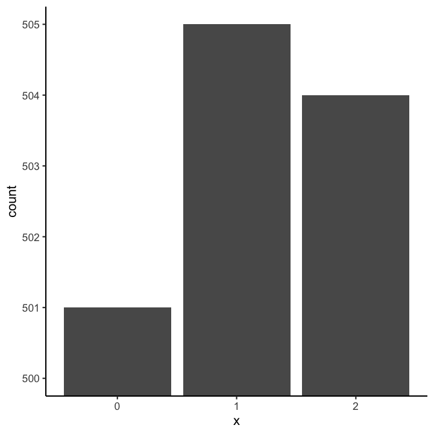
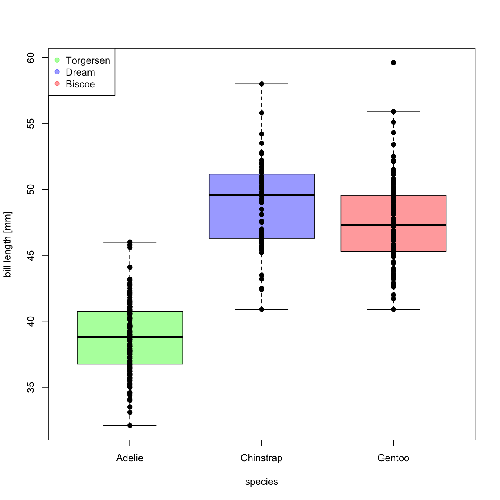
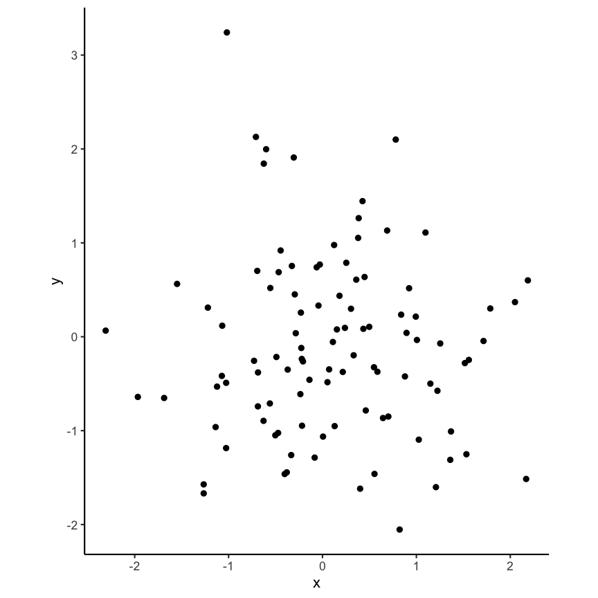

---
# Please do not edit this file directly; it is auto generated.
# Instead, please edit 05-ReproducibleNotebooksForDataAnalysis.md in _episodes_rmd/
source: Rmd
title: "Reproducible notebooks for data analysis"
teaching: 60
exercises: 90-120
questions: 
  - "Should I use a graphical user interface to analyse data or a code-based system?"
  - "What is literate programming and what is R Markdown?"
  - "How do I use R  Markdown"
objectives: 
  - "Understand the advantages of code-based data analysis"
  - "Able to create and adapt an R Markdown script"
  - "Adapt YAML header"
  - "Use code chunks and choose the right chunk option"
  - "Practice by answering simple questions"
  - "Bonus: add a table to an R Markdown script"
  - "Bonus: add a graphic to an R Markdown script"
keypoints:
  - "Code-based analysis is better for reproducibility."
  - "Combining narrative and code-based results is even more profitable."
  - "Code chunks in R Markdown provide an easy solution"
---


# 1. Reproducibility of analysis code


## Graphical user interface (GUI) vs. code

Statistical analysis software packages with graphical user interfaces such as SPSS (often) provide an easy solution to data analysis because

- one can get started with an analysis without much overhead in having to learn to code 
- it is a convenient way of exploring the data is needed 
- figures and the statistical analysis are done at the end of the exploration

**But** it is often not clear anymore how exactly (and with which commands) those results were obtained. 
 
An analysis that is not reproducible can be an issue since 

- it is easy to unintentionally introduce errors and 
- it is hard to get rid of errors 
- if you need to change some step in the middle of the analysis you have to restart from scratch
- you can not provide a workflow that others (or yourself in the future) can follow easily to reproduce the results

To make your analysis reproducible with a GUI program it would be necessary to write down all steps that were done which can be very tedious. Even if some kind of history of the executed commands is saved it might still be necessary to clean this up and keep only the relevant steps.  
 
On the other hand doing a statistical analysis purely with code seems to be a lot of effort since all steps have to be written down explicitly and in case of unfamiliarity with the used programming language some initial investment to get familiar with a new environment and maybe also some basic concepts of programming need to be learned. However, while it seems like a big hurdle modern programming languages designed for statistical computing, such as R, are usually pretty straightforward to learn and use.   
 
Furthermore code based analysis are **more flexible** since usually more combinations, functions and extensions are available. In R, for example, thousands of packages are available. Besides, written analyses are easily **reproducible** as all commands that have been executed are written down and if complemented with comments and descriptions are also easily understandable for humans. 

Such a coded analysis script provides a complete account of what has been calculated, much more complete than any narrative text on used methods could ever be. 

Another point not to underestimate are the many readily available analyses that can be copied and used as a starting point for your own analysis which greatly increases speed and reduces the amount of work. Related to that is the concept of reusing code if for instance you have similar parts in your analysis.  

To summarize:

* **Disadvantages**
  - need to code
  - writing instead of clicking
* **Advantages**
  - Flexible
  - Extensible (packages)
  - Reproducible (easily rerun from scratch)
  - Mixing code and text increases readability 
  - Complete account of analysis
  - start from similar analyses


## R projects

Another very useful concept that enhances R's usefulness via Rstudio are R Projects. They allow to easily implement the structures that we heard about in the Reproducibility and Data episode (Organisation and software). You start with a directory for each project, have your data, code results etc in subdirectories and the projects functionality of Rstudio allows you to communicate easily between these directories.   

The main idea is that all files needed (scripts, data, ...) for an analysis are brought together to make your and your collaborators life easier. If you start a Project it automatically takes care of things like using the correct working directory and lets you quickly jump between different projects by remembering which files you had open and reopening them again.   

Connected to the use of Project is the concept that you use relative file paths (e.g. for loading csv files). So instead of doing something like this: `read.csv("/home/user/Documents/Uni/Basics_of_Open_Science/Topic_5/data/example.csv")` you write `read.csv("data/example.csv")`. This is easier to write, more flexible and less prone to errors because as long as you keep your files in the project together it will work. Imagine for example you want to move your script (and data) to `"/home/user/backup/Uni/Basics_of_Open_Science/Topic_5/data/example.csv"`. 

R Projects hence make collaboration easier, your script won't work on a different computer and you have to manually adjust the file path. This gets even worse if multiple people work on the same analysis and every one has to change their scripts. 

Another advantage of R Projects is the possibility to quickly switch to another project without mixing up scripts and data between projects. Without using R Projects you probably have to close the files you have open, change the working directory to the new location, open the files you will be using and restart the R session. With R Projects this is all done automatically.


## Quiz on R projects 

> ## File path
> Suppose your current working directory is ~/project and you want to specify the relative path to the file ~/project/data/data.csv . What are possible specifications?
> - data.csv  
> - project/data.csv  
> - project/data/data.csv  
> - data/data.csv  
>
{: .challenge}

> ## Solution
> 
> F data.csv  
> F project/data.csv  
> F project/data/data.csv  
> T data/data.csv  
>
{: .solution}


# 2. Literate programming and R Markdown

R Markdown is a realisation of the **literate programming** concept mixing narrative text with analysis code which is then rendered into formatted text and analysis results (numbers, tables and graphics). The concept of literate programming goes back to Donald Knuth, see e.g. from the [open-science-with-r carpentries course](https://carpentries-incubator.github.io/open-science-with-r/02-Rstudio/index.html):

> _
More generally, the mixture of code, documentation (conclusion, comments) and 
figures in a notebook is part of the so-called “literate programming” paradigm
(Donald Knuth, 1984). Your code and logical steps should be understandable for 
human beings. In particular these four tips are related to this paradigm:
_
>
- _Do not write your program only for R but think also of code readers (that 
  includes you)._
- _Focus on the logic of your workflow. Describe it in plain language (e.g. 
  English) to explain the steps and why you are doing them._
- _Explain the “why” and not the “how”._
- _Create a report from your analysis using a R Markdown notebook to wrap together 
  the data + code + text._


## Parts of an R Markdown (.Rmd) file

### Create a new Rmd
**Execute the following steps on your computer while you read:** 

Go to `File` > `New File` > `R Markdown`, enter `Title` and `Author`, select `html` as output, confirm.
A new .Rmd file should open with a short tutorial. 

To render, or `knit`, the file to `html` press `Knit`. The first time you run the script you will have to specify the name under which to save it. Afterwards the script is always saved before rendering. 

An R Markdown file consists of multiple parts which we will discuss now.

### YAML header 

More information about the YAML header can be found in the [R Markdown cheat sheet](https://raw.githubusercontent.com/rstudio/cheatsheets/main/rmarkdown.pdf).

Short summary from the [open-science-with-r carpentries course](https://carpentries-incubator.github.io/open-science-with-r/02-Rstudio/index.html):

> _
The header of your R Markdown document will allow you to personalize the related
report from your R Markdown document.
The header follows the YAML syntax (“YAML Ain’t Markup Language”) which usually
follows a key:value syntax.
_

For example, `title: "titlename"`, where `title` is the key and `"titlename"` is the value.

The header itself starts with `---` and stops with `---`. For example:

```
---
title: "titlename"
output: html_output
---
```


### Code chunks

The narrative text is written in Markdown. Code chunks contain R code that is to be executed when rendering the chunk or the entire file, i.e. including the data analysis. A code chunk is delimited from plain text using the following syntax:
To start a chunk write (backticks) 
` ```{r} `, then place your R code and end the chunk with
` ``` `. The `r` in 
` ```{r} ` indicates that the programming language used in this chunk is R. Other options include `python` or
`bash` although we will not need these here.  
Within RStudio a new code chunk can be included by either clicking on `Insert a new code chunk` in the toolbar or using a keyboard shortcut (`Ctrl+Alt+I` on Windows and `Option+Command+I` on Mac).

Each chunk can be run separately. To run the code in an individual chunk click on the green arrow (`Run Current Chunk`) on the right side of the chunk. 
Alternatively use the keyboard shortcut `Ctrl+Alt+T` (Windows) or `Option+Command+T` (Mac) to run the current chunk (i.e. where your cursor is located). This runs only the code in the specific chunk but does not render the entire file.

For more options see the cheat sheet in R studio: `Help` > `Cheat Sheets` > `R Markdown Cheat Sheet` or the link above.


The behavior of the chunks can be changed by setting chunk options. This is done in the opening of the chunk, e.g. 
` ```{r, echo=FALSE}`, which hides the code of this chunk (while still evaluating it). For more options see the cheat sheet in R studio: `Help`>`Cheat Sheets`>`R Markdown Cheat Sheet` or see the [R Markdown Cookbook](https://bookdown.org/yihui/rmarkdown-cookbook/chunk-options.html).

*Note*: inline R code, i.e. code directly within the narrative text, can be run with ``` `r ` ``` , placing the code after `r `. This is for example usefull when you mention a sample size in the text and want it to update directly from the data set you read in.


## Quiz on literate programming and R Markdown

> ## Literate programming
> Which of the following statements about literate programming are true?  
> - Literate programming combines code and text.  
> - Literate programming makes your code run more efficient.  
> - Literate programming makes your analysis easier to understand.  
> - Code should only be shown if necessary.  
> - Plots should not be included.  
>
{: .challenge}

> ## Solution
> 
> T Literate programming combines code and text.  
> F Literate programming makes your code run more efficient.  
> T Literate programming makes your analysis easier to understand.  
> F Code should only be shown if necessary.  
> F Plots should not be included.  
>
{: .solution}


> ## YAML header: author
> How do you specify the author in an R Markdown document?  
> - author: "name"  
> - Author: "name"  
> - Author = "name"  
> - Author: 'name'  
> - author: name  
>
{: .challenge}

> ## Solution
> 
> T author: "name"  
> F Author: "name"  
> F Author = "name"  
> F Author: 'name'  
> T author: name  
>
{: .solution}


> ## YAML header: date
> How do you set the date?  
> - Date: 01/01/2021  
> - Date = 01/01/2021  
> - datum: 01/01/2021  
> - date: 01/01/2021  
>
{: .challenge}

> ## Solution
> 
> F Date: 01/01/2021  
> F Date = 01/01/2021  
> F datum: 01/01/2021  
> T date: 01/01/2021  
>
{: .solution}


> ## Chunk options
> How do you prevent code from evaluation in a chunk?  
> - evaluate=FALSE  
> - eval=FALSE  
> - noeval=TRUE  
> - hinder=TRUE  
> - hind=TRUE  
> - interpret=FALSE  
> - inpr=FALSE  
>
{: .challenge}

> ## Solution
> 
> F evaluate=FALSE  
> T eval=FALSE  
> F noeval=TRUE  
> F hinder=TRUE  
> F hind=TRUE  
> F interpret=FALSE  
> F inpr=FALSE  
>
{: .solution}


> ## Chunk options: figure height
> How do you adjust the figure height?  
> - figure_height=100  
> - figureheight=100  
> - heightfigure=100  
> - fig_height=100  
> - fig.height=100  
> - height.fig=100  
>
{: .challenge}

> ## Solution
> 
> F figure_height=100  
> F figureheight=100  
> F heightfigure=100  
> F fig_height=100  
> T fig.height=100  
> F height.fig=100  
>
{: .solution}


> ## R Markdown Practice
>Modify the template found [here]({{ page.root }}/files/docs/06/RMarkdown_exercise.Rmd) by performing the following steps:
>
>* add author and date to YAML header
>* rename the first chunk to `print_chunk_nr_1`
>* set the chunk options of chunk 2 to not show the code
>* set the chunk options of chunk 3 to not evaluate the code but show it
>* set the chunk options of chunk 4 to not show the warning
>* complete the sentence at the end with appropriate information calculated in chunk 5
After these steps answer the questions below.
{: .challenge}


> ## R Markdown practice 1
> The percentage of children who survived the Titanic accident was (Note: round to one decimal digit) 
>
{: .challenge}

> ## Solution
> 
> 52.3 
>
{: .solution}


> ## R Markdown practice 2
> The percentage of female survivors was ___ times higher as the percentage of male survivors. (Note: round to two decimal digits) 
>
{: .challenge}

> ## Solution
> 
> 3.45 
>
{: .solution}


# Episode challenge

The goal of this challenge is to create a fully reproducible analysis within an R Markdown script which is easy to understand and read. For that, describe what you do and do not forget nice formatting. For example try different Markdown syntax (Headers, ...), figure captions (*Hint*: check the chunk options for this), a meaningful YAML header, etc.


>## Analysis of the palmer penguins data
Create a new R Markdown document and write the code for each of the below questions in a separate paragraph/chunk and describe the result in a complete sentence directly in the R Markdown document. We will use the `penguins` dataset from the package `palmerpenguins`, available as the data set `penguins` after installing the package `palmerpenguins`. To get an overview of the data load the `penguins` dataset and with the following questions: 
> 
> &nbsp;
> 
>>## Question 1
Find the the source of the `penguins` dataset together with the url to the data repository. *Hint*: run `?penguins`
>{: .checklist}
>
>> ## Solution 1
>> 
>> ~~~
>> library(palmerpenguins)
>> ~~~
>> {: .language-r}
>> Can I put ?penguins in the chunk?
>> 
The source is:
Adélie penguins: Palmer Station Antarctica LTER and K. Gorman. 2020. Structural size measurements and isotopic signatures of foraging among adult male and female Adélie penguins (Pygoscelis adeliae) nesting along the Palmer Archipelago near Palmer Station, 2007-2009 ver 5. Environmental Data Initiative. doi: 10.6073/pasta/98b16d7d563f265cb52372c8ca99e60f
>> 
Gentoo penguins: Palmer Station Antarctica LTER and K. Gorman. 2020. Structural size measurements and isotopic signatures of foraging among adult male and female Gentoo penguin (Pygoscelis papua) nesting along the Palmer Archipelago near Palmer Station, 2007-2009 ver 5. Environmental Data Initiative. doi: 10.6073/pasta/7fca67fb28d56ee2ffa3d9370ebda689
>> 
Chinstrap penguins: Palmer Station Antarctica LTER and K. Gorman. 2020. Structural size measurements and isotopic signatures of foraging among adult male and female Chinstrap penguin (Pygoscelis antarcticus) nesting along the Palmer Archipelago near Palmer Station, 2007-2009 ver 6. Environmental Data Initiative. doi: 10.6073/pasta/c14dfcfada8ea13a17536e73eb6fbe9e
>< 
Originally published in: Gorman KB, Williams TD, Fraser WR (2014) Ecological Sexual Dimorphism and Environmental Variability within a Community of Antarctic Penguins (Genus Pygoscelis). PLoS ONE 9(3): e90081. doi:10.1371/journal.pone.0090081
>> 
>{: .solution}
> &nbsp;
>  
>>## Question 2
Create a Markdown table describing the `penguins` data: for each **numeric** column in the dataset create a row in the table which should consist of the following columns: `Column_Name`, `Mean`, `Variance`  
>>*Hint*: Checkout the function `knitr::kable` and the chunk option `results='asis'`.
>{: .checklist}
>  
>  
>> ## Solution 2
>> 
>> ~~~
>> numericcols <- sapply(colnames(penguins), function(x) is.numeric(penguins[[x]]))
>> df <- data.frame(Column_Name = names(numericcols)[numericcols],
>>                  Mean = signif(apply((na.omit(penguins[numericcols])), 2, mean), 4),
>>                  Variance = signif(apply((na.omit(penguins[numericcols])), 2, var), 4),
>>                  row.names = NULL
>>                  )
>> knitr::kable(df)
>> ~~~
>> {: .language-r}
>> 
>> 
>> 
>> |Column_Name       |    Mean|  Variance|
>> |:-----------------|-------:|---------:|
>> |bill_length_mm    |   43.92| 2.981e+01|
>> |bill_depth_mm     |   17.15| 3.900e+00|
>> |flipper_length_mm |  200.90| 1.977e+02|
>> |body_mass_g       | 4202.00| 6.431e+05|
>> |year              | 2008.00| 6.678e-01|
>>
>{: .solution}
> &nbsp;
>  
>>## Question 3
How many rows does the `penguins` dataset have? 
>{: .checklist}
>
>> ## Solution 3
>> 
>> ~~~
>> result_question_3 <- dim(penguins)[1]
>> ~~~
>> {: .language-r}
>> The data set has 344 rows.
>> 
>{: .solution}
> &nbsp;
>  
>>## Question 4
What is the first year of records in the data set? 
>{: .checklist}
>
>> ## Solution 4
>> 
>> ~~~
>> result_question_4 <- min(penguins$year)
>> ~~~
>> {: .language-r}
>> The first year of records is 2007.
>>
>{: .solution}
> &nbsp;
>  
>>## Question 5
What is the total number of Adelie penguins? 
>{: .checklist}
>
>> ## Solution 5
>> 
>> ~~~
>> result_question_5 <- sum(penguins$species == "Adelie")
>> ~~~
>> {: .language-r}
>> The total number of Adelie penguins is 152
>>
>{: .solution}
> &nbsp;
>  
>>## Question 6
What is the total number of missing values (`NA`)?
>{: .checklist}
>
>> ## Solution 6
>> 
>> ~~~
>> result_question_6 <- sum(is.na(penguins))
>> ~~~
>> {: .language-r}
>> The total number of missing values (NA's) is 19.
>> 
>{: .solution}
> &nbsp;
>  
>>## Question 7
What is the total number of rows with **no** missing values?
>{: .checklist}
>
>> ## Solution 7
>> 
>> ~~~
>> result_question_7 <- sum(apply(penguins, 1, function(x) !any(is.na(x))))
>> ~~~
>> {: .language-r}
>> The number of complete rows (rows with no missing values, i.e. NA's) is `rresult_question_7`.
>> 
>{: .solution}
> &nbsp;
>  
>>## Question 8
On which islands were the Gentoo penguins found?
>{: .checklist}
>
>> ## Solution 8
>> 
>> ~~~
>> result_question_8 <- unique(penguins$island[penguins$species == "Gentoo"]);
>> ~~~
>> {: .language-r}
>> The name of islands where the Gentoo penguins were found is Biscoe.
>> 
>{: .solution}
> &nbsp;
>  
>>## Question 9
What is the proportion of Adelie penguins on Dream island (compared to all penguins on Dream island)?
>{: .checklist}
>
>> ## Solution 9
>> 
>> ~~~
>> result_question_9 <- sum(penguins$species == "Adelie" & 
>>                            penguins$island == "Dream") / 
>>                       sum(penguins$island == "Dream")
>> ~~~
>> {: .language-r}
>> 
>> The proportion of Adelie penguins on Dream island is 0.4516129.
>> 
>{: .solution}
> &nbsp;
>  
>>## Question 10
What is the 93% quantile of the bill lengths in mm?
>{: .checklist}
>
>> ## Solution 10
>> 
>> ~~~
>> result_question_10 <- quantile(na.omit(penguins$bill_length_mm), 0.93)
>> ~~~
>> {: .language-r}
>> The 93 % quantile of `bill_length_mm` is 51.3.
>> 
>{: .solution}
> &nbsp;
>  
>>## Question 11
What is the absolute mean difference of  bill depth  in mm between female and male penguins?
>{: .checklist}
>
>> ## Solution 11
>> 
>> ~~~
>> result_question_11 <- abs(coef(lm(bill_depth_mm ~ sex, penguins))[2])
>> ~~~
>> {: .language-r}
>> The absolute mean difference of `bill_depth_mm` between female and male is 1.4656169.
>> 
>{: .solution}
> &nbsp;
>  
>>## Question 12
What is the 95% confidence interval of the slope of the linear regression with intercept of bill depth regressed on sex? Result will be a vector of two elements, e.g. `c('lower_limit', 'upper_limit')`.
>{: .checklist}
>  
>> ## Solution 12
>> 
>> ~~~
>> result_question_12 <- confint(lm(bill_depth_mm ~ sex, penguins), "sexmale" )
>> ~~~
>> {: .language-r}
>> The 95% confidence interval of the slope of the linear regression between `bill_depth_mm` and `sex` is 1.0710254, 1.8602083
>> 
>{: .solution}
> &nbsp;
>  
>>## Question 13
What is the proportion of Chinstrap penguins with flipper length in mm smaller than 205 and bill length in mm larger than 45 compared to all penguins with flipper length in mm smaller than 205 and bill length in mm larger than 45?
>{: .checklist}
>  
>> ## Solution 13
>> 
>> ~~~
>> chins <- na.omit(penguins$species[penguins$flipper_length_mm < 205 & 
>>                                     penguins$bill_length_mm > 45])
>> result_question_13 <- sum(chins == "Chinstrap") / length(chins)
>> ~~~
>> {: .language-r}
>> The proportion of Chinstrap penguins with `flipper_length_mm` smaller than 205 and `bill_length_mm` larger than 45 compared to all penguins with `flipper_length_mm` smaller than 205 and `bill_length_mm` larger than 45 is 0.9310345.
>>
>{: .solution}
> &nbsp;
>  
>>## Question 14
What is the proportion of Chinstrap penguins with `flipper_length_mm` smaller than 205 and `bill_length_mm` larger than 45 compared to all Chinstrap penguins?
>{: .checklist}
>  
>> ## Solution 14
>> 
>> ~~~
>> result_question_14 <- sum(chins == "Chinstrap") / sum(penguins$species == "Chinstrap")
>> ~~~
>> {: .language-r}
>> The proportion of Chinstrap penguins with `flipper_length_mm` smaller than 205 and `bill_length_mm` larger than 45 compared to all Chinstrap penguins is 0.7941176.
>> 
>{: .solution}
{: .challenge}


&nbsp;

# Bonus challenge


## R Markdown tables

For the following challenge we will use the package `kableExtra` which extends the base capabilities of `knitr::kable` to create tables. From the package [vignette](http://haozhu233.github.io/kableExtra/awesome_table_in_html.html):


> _
The goal of kableExtra is to help you build common complex tables and manipulate table styles. It imports the pipe %>% symbol from magrittr and verbalize all the functions, so basically you can add “layers” to a kable output in a way that is similar with ggplot2 and plotly._


For users who are not very familiar with the pipe operator %>% in R: it is the R version of the fluent interface. The idea is to pass the result along the chain for a more literal coding experience. Basically, when we say A %>% B, technically it means sending the results of A to B as B’s first argument.


Simple tables can be generated as follows:

~~~
library(kableExtra)
head(penguins) %>% # the dataset, '%>%' parses the output of this command as the input in the next command 
  kbl() %>% # the kableExtra equivalent of knitr::kable, base table
  kable_classic() # add theme to table
~~~
{: .language-r}

<table class=" lightable-classic" style='font-family: "Arial Narrow", "Source Sans Pro", sans-serif; margin-left: auto; margin-right: auto;'>
 <thead>
  <tr>
   <th style="text-align:left;"> species </th>
   <th style="text-align:left;"> island </th>
   <th style="text-align:right;"> bill_length_mm </th>
   <th style="text-align:right;"> bill_depth_mm </th>
   <th style="text-align:right;"> flipper_length_mm </th>
   <th style="text-align:right;"> body_mass_g </th>
   <th style="text-align:left;"> sex </th>
   <th style="text-align:right;"> year </th>
  </tr>
 </thead>
<tbody>
  <tr>
   <td style="text-align:left;"> Adelie </td>
   <td style="text-align:left;"> Torgersen </td>
   <td style="text-align:right;"> 39.1 </td>
   <td style="text-align:right;"> 18.7 </td>
   <td style="text-align:right;"> 181 </td>
   <td style="text-align:right;"> 3750 </td>
   <td style="text-align:left;"> male </td>
   <td style="text-align:right;"> 2007 </td>
  </tr>
  <tr>
   <td style="text-align:left;"> Adelie </td>
   <td style="text-align:left;"> Torgersen </td>
   <td style="text-align:right;"> 39.5 </td>
   <td style="text-align:right;"> 17.4 </td>
   <td style="text-align:right;"> 186 </td>
   <td style="text-align:right;"> 3800 </td>
   <td style="text-align:left;"> female </td>
   <td style="text-align:right;"> 2007 </td>
  </tr>
  <tr>
   <td style="text-align:left;"> Adelie </td>
   <td style="text-align:left;"> Torgersen </td>
   <td style="text-align:right;"> 40.3 </td>
   <td style="text-align:right;"> 18.0 </td>
   <td style="text-align:right;"> 195 </td>
   <td style="text-align:right;"> 3250 </td>
   <td style="text-align:left;"> female </td>
   <td style="text-align:right;"> 2007 </td>
  </tr>
  <tr>
   <td style="text-align:left;"> Adelie </td>
   <td style="text-align:left;"> Torgersen </td>
   <td style="text-align:right;"> NA </td>
   <td style="text-align:right;"> NA </td>
   <td style="text-align:right;"> NA </td>
   <td style="text-align:right;"> NA </td>
   <td style="text-align:left;"> NA </td>
   <td style="text-align:right;"> 2007 </td>
  </tr>
  <tr>
   <td style="text-align:left;"> Adelie </td>
   <td style="text-align:left;"> Torgersen </td>
   <td style="text-align:right;"> 36.7 </td>
   <td style="text-align:right;"> 19.3 </td>
   <td style="text-align:right;"> 193 </td>
   <td style="text-align:right;"> 3450 </td>
   <td style="text-align:left;"> female </td>
   <td style="text-align:right;"> 2007 </td>
  </tr>
  <tr>
   <td style="text-align:left;"> Adelie </td>
   <td style="text-align:left;"> Torgersen </td>
   <td style="text-align:right;"> 39.3 </td>
   <td style="text-align:right;"> 20.6 </td>
   <td style="text-align:right;"> 190 </td>
   <td style="text-align:right;"> 3650 </td>
   <td style="text-align:left;"> male </td>
   <td style="text-align:right;"> 2007 </td>
  </tr>
</tbody>
</table>

For all options check the documentation or the [vignette](http://haozhu233.github.io/kableExtra/awesome_table_in_html.html).


## Task 1 Create the following table:

<table class=" lightable-classic table table-hover" style='font-family: "Arial Narrow", "Source Sans Pro", sans-serif; margin-left: auto; margin-right: auto; margin-left: auto; margin-right: auto;'>
 <thead>
<tr>
<th style="empty-cells: hide;" colspan="1"></th>
<th style="padding-bottom:0; padding-left:3px;padding-right:3px;text-align: center; " colspan="3"><div style="border-bottom: 1px solid #111111; margin-bottom: -1px; ">bill length [mm]</div></th>
<th style="padding-bottom:0; padding-left:3px;padding-right:3px;text-align: center; " colspan="3"><div style="border-bottom: 1px solid #111111; margin-bottom: -1px; ">bill depth [mm]</div></th>
</tr>
  <tr>
   <th style="text-align:left;"> species </th>
   <th style="text-align:right;"> 2007 </th>
   <th style="text-align:right;"> 2008 </th>
   <th style="text-align:right;"> 2009 </th>
   <th style="text-align:right;"> 2007 </th>
   <th style="text-align:right;"> 2008 </th>
   <th style="text-align:right;"> 2009 </th>
  </tr>
 </thead>
<tbody>
  <tr>
   <td style="text-align:left;border-right:1px solid;"> Adelie </td>
   <td style="text-align:right;"> 38.8 </td>
   <td style="text-align:right;"> 38.6 </td>
   <td style="text-align:right;border-right:1px solid;"> 39.0 </td>
   <td style="text-align:right;"> 18.8 </td>
   <td style="text-align:right;"> 18.2 </td>
   <td style="text-align:right;"> 18.1 </td>
  </tr>
  <tr>
   <td style="text-align:left;border-right:1px solid;"> Chinstrap </td>
   <td style="text-align:right;"> 48.7 </td>
   <td style="text-align:right;"> 48.7 </td>
   <td style="text-align:right;border-right:1px solid;"> 49.1 </td>
   <td style="text-align:right;"> 18.5 </td>
   <td style="text-align:right;"> 18.4 </td>
   <td style="text-align:right;"> 18.3 </td>
  </tr>
  <tr>
   <td style="text-align:left;border-right:1px solid;"> Gentoo </td>
   <td style="text-align:right;"> 47.0 </td>
   <td style="text-align:right;"> 46.9 </td>
   <td style="text-align:right;border-right:1px solid;"> 48.5 </td>
   <td style="text-align:right;"> 14.7 </td>
   <td style="text-align:right;"> 14.9 </td>
   <td style="text-align:right;"> 15.3 </td>
  </tr>
</tbody>
</table>

*Hint*: checkout the different styling functions, e.g. `kable_classic`.  
*Hint*: For multiple column names use `add_header_above`  
*Hint*: Use the following code to get started.  

>## Solution
> 
> ~~~
> df_sum <- penguins %>% 
>   dplyr::select(-sex, -island, -flipper_length_mm, -body_mass_g) %>% 
>   dplyr::group_by(species, year) %>% 
>   dplyr::summarise(dplyr::across(.fns = function(x) signif(mean(na.omit(x)), 3))) %>% 
>   tidyr::pivot_wider(names_from = c(year), values_from = c(bill_length_mm, bill_depth_mm)) 
> 
> df_sum %>%
>   kbl(col.names = c("species", rep(c("2007", "2008", "2009"), 2)))%>%
>   kable_classic() %>%
>   add_header_above(c(" " = 1, "bill length [mm]" = 3, "bill depth [mm]" = 3)) %>%
>   kable_styling(bootstrap_options = c("hover")) %>% 
>   column_spec (c(1, 4), border_right = T) 
> ~~~
> {: .language-r}
{: .solution}

## Task 2 Create the following table wich includes small graphs:

<table class=" lightable-paper" style='font-family: "Arial Narrow", arial, helvetica, sans-serif; margin-left: auto; margin-right: auto;'>
 <thead>
<tr>
<th style="empty-cells: hide;" colspan="1"></th>
<th style="padding-bottom:0; padding-left:3px;padding-right:3px;text-align: center; " colspan="3"><div style="border-bottom: 1px solid #00000020; padding-bottom: 5px; ">bill length [mm]</div></th>
<th style="padding-bottom:0; padding-left:3px;padding-right:3px;text-align: center; " colspan="3"><div style="border-bottom: 1px solid #00000020; padding-bottom: 5px; ">bill depth [mm]</div></th>
</tr>
  <tr>
   <th style="text-align:left;"> species </th>
   <th style="text-align:right;"> mean </th>
   <th style="text-align:left;"> boxplot </th>
   <th style="text-align:left;"> histogram </th>
   <th style="text-align:right;"> mean </th>
   <th style="text-align:left;"> boxplot </th>
   <th style="text-align:left;"> histogram </th>
  </tr>
 </thead>
<tbody>
  <tr>
   <td style="text-align:left;border-right:1px solid;"> Adelie </td>
   <td style="text-align:right;"> 38.8 </td>
   <td style="text-align:left;">  <svg xmlns="http://www.w3.org/2000/svg" xmlns:xlink="http://www.w3.org/1999/xlink" class="svglite" width="48.00pt" height="12.00pt" viewbox="0 0 48.00 12.00"><defs><style type="text/css">
    .svglite line, .svglite polyline, .svglite polygon, .svglite path, .svglite rect, .svglite circle {
      fill: none;
      stroke: #000000;
      stroke-linecap: round;
      stroke-linejoin: round;
      stroke-miterlimit: 10.00;
    }
    .svglite text {
      white-space: pre;
    }
  </style></defs><rect width="100%" height="100%" style="stroke: none; fill: none;"></rect><defs><clippath id="cpMC4wMHw0OC4wMHwwLjAwfDEyLjAw"><rect x="0.00" y="0.00" width="48.00" height="12.00"></rect></clippath></defs><g clip-path="url(#cpMC4wMHw0OC4wMHwwLjAwfDEyLjAw)"><polygon points="9.29,8.22 9.29,3.78 15.76,3.78 15.76,8.22 " style="stroke-width: 0.75; stroke: none; fill: #D3D3D3;"></polygon><line x1="12.61" y1="8.22" x2="12.61" y2="3.78" style="stroke-width: 0.75; stroke: #FF0000; stroke-linecap: butt;"></line><line x1="1.78" y1="6.00" x2="9.29" y2="6.00" style="stroke-width: 0.75;"></line><line x1="24.24" y1="6.00" x2="15.76" y2="6.00" style="stroke-width: 0.75;"></line><line x1="1.78" y1="7.11" x2="1.78" y2="4.89" style="stroke-width: 0.75;"></line><line x1="24.24" y1="7.11" x2="24.24" y2="4.89" style="stroke-width: 0.75;"></line><polygon points="9.29,8.22 9.29,3.78 15.76,3.78 15.76,8.22 " style="stroke-width: 0.75; stroke: none;"></polygon></g></svg>
</td>
   <td style="text-align:left;border-right:1px solid;">  <svg xmlns="http://www.w3.org/2000/svg" xmlns:xlink="http://www.w3.org/1999/xlink" class="svglite" width="48.00pt" height="12.00pt" viewbox="0 0 48.00 12.00"><defs><style type="text/css">
    .svglite line, .svglite polyline, .svglite polygon, .svglite path, .svglite rect, .svglite circle {
      fill: none;
      stroke: #000000;
      stroke-linecap: round;
      stroke-linejoin: round;
      stroke-miterlimit: 10.00;
    }
    .svglite text {
      white-space: pre;
    }
  </style></defs><rect width="100%" height="100%" style="stroke: none; fill: none;"></rect><defs><clippath id="cpMC4wMHw0OC4wMHwwLjAwfDEyLjAw"><rect x="0.00" y="0.00" width="48.00" height="12.00"></rect></clippath></defs><g clip-path="url(#cpMC4wMHw0OC4wMHwwLjAwfDEyLjAw)">
</g><defs><clippath id="cpMC4wMHw0OC4wMHwyLjg4fDEyLjAw"><rect x="0.00" y="2.88" width="48.00" height="9.12"></rect></clippath></defs><g clip-path="url(#cpMC4wMHw0OC4wMHwyLjg4fDEyLjAw)"><rect x="1.62" y="10.77" width="3.23" height="0.89" style="stroke-width: 0.38; fill: #D3D3D3;"></rect><rect x="4.85" y="6.77" width="3.23" height="4.89" style="stroke-width: 0.38; fill: #D3D3D3;"></rect><rect x="8.08" y="3.66" width="3.23" height="8.00" style="stroke-width: 0.38; fill: #D3D3D3;"></rect><rect x="11.31" y="3.22" width="3.23" height="8.44" style="stroke-width: 0.38; fill: #D3D3D3;"></rect><rect x="14.55" y="3.88" width="3.23" height="7.78" style="stroke-width: 0.38; fill: #D3D3D3;"></rect><rect x="17.78" y="9.22" width="3.23" height="2.44" style="stroke-width: 0.38; fill: #D3D3D3;"></rect><rect x="21.01" y="10.55" width="3.23" height="1.11" style="stroke-width: 0.38; fill: #D3D3D3;"></rect></g></svg>
</td>
   <td style="text-align:right;"> 18.3 </td>
   <td style="text-align:left;">  <svg xmlns="http://www.w3.org/2000/svg" xmlns:xlink="http://www.w3.org/1999/xlink" class="svglite" width="48.00pt" height="12.00pt" viewbox="0 0 48.00 12.00"><defs><style type="text/css">
    .svglite line, .svglite polyline, .svglite polygon, .svglite path, .svglite rect, .svglite circle {
      fill: none;
      stroke: #000000;
      stroke-linecap: round;
      stroke-linejoin: round;
      stroke-miterlimit: 10.00;
    }
    .svglite text {
      white-space: pre;
    }
  </style></defs><rect width="100%" height="100%" style="stroke: none; fill: none;"></rect><defs><clippath id="cpMC4wMHw0OC4wMHwwLjAwfDEyLjAw"><rect x="0.00" y="0.00" width="48.00" height="12.00"></rect></clippath></defs><g clip-path="url(#cpMC4wMHw0OC4wMHwwLjAwfDEyLjAw)"><polygon points="25.06,8.22 25.06,3.78 32.99,3.78 32.99,8.22 " style="stroke-width: 0.75; stroke: none; fill: #D3D3D3;"></polygon><line x1="29.82" y1="8.22" x2="29.82" y2="3.78" style="stroke-width: 0.75; stroke: #FF0000; stroke-linecap: butt;"></line><line x1="14.48" y1="6.00" x2="25.06" y2="6.00" style="stroke-width: 0.75;"></line><line x1="44.63" y1="6.00" x2="32.99" y2="6.00" style="stroke-width: 0.75;"></line><line x1="14.48" y1="7.11" x2="14.48" y2="4.89" style="stroke-width: 0.75;"></line><line x1="44.63" y1="7.11" x2="44.63" y2="4.89" style="stroke-width: 0.75;"></line><polygon points="25.06,8.22 25.06,3.78 32.99,3.78 32.99,8.22 " style="stroke-width: 0.75; stroke: none;"></polygon><circle cx="46.22" cy="6.00" r="0.54" style="stroke-width: 0.75;"></circle></g></svg>
</td>
   <td style="text-align:left;">  <svg xmlns="http://www.w3.org/2000/svg" xmlns:xlink="http://www.w3.org/1999/xlink" class="svglite" width="48.00pt" height="12.00pt" viewbox="0 0 48.00 12.00"><defs><style type="text/css">
    .svglite line, .svglite polyline, .svglite polygon, .svglite path, .svglite rect, .svglite circle {
      fill: none;
      stroke: #000000;
      stroke-linecap: round;
      stroke-linejoin: round;
      stroke-miterlimit: 10.00;
    }
    .svglite text {
      white-space: pre;
    }
  </style></defs><rect width="100%" height="100%" style="stroke: none; fill: none;"></rect><defs><clippath id="cpMC4wMHw0OC4wMHwwLjAwfDEyLjAw"><rect x="0.00" y="0.00" width="48.00" height="12.00"></rect></clippath></defs><g clip-path="url(#cpMC4wMHw0OC4wMHwwLjAwfDEyLjAw)">
</g><defs><clippath id="cpMC4wMHw0OC4wMHwyLjg4fDEyLjAw"><rect x="0.00" y="2.88" width="48.00" height="9.12"></rect></clippath></defs><g clip-path="url(#cpMC4wMHw0OC4wMHwyLjg4fDEyLjAw)"><rect x="14.48" y="10.76" width="2.65" height="0.90" style="stroke-width: 0.38; fill: #D3D3D3;"></rect><rect x="17.12" y="10.15" width="2.65" height="1.51" style="stroke-width: 0.38; fill: #D3D3D3;"></rect><rect x="19.77" y="7.44" width="2.65" height="4.22" style="stroke-width: 0.38; fill: #D3D3D3;"></rect><rect x="22.41" y="5.93" width="2.65" height="5.73" style="stroke-width: 0.38; fill: #D3D3D3;"></rect><rect x="25.06" y="5.03" width="2.65" height="6.63" style="stroke-width: 0.38; fill: #D3D3D3;"></rect><rect x="27.70" y="4.42" width="2.65" height="7.24" style="stroke-width: 0.38; fill: #D3D3D3;"></rect><rect x="30.35" y="3.22" width="2.65" height="8.44" style="stroke-width: 0.38; fill: #D3D3D3;"></rect><rect x="32.99" y="7.14" width="2.65" height="4.52" style="stroke-width: 0.38; fill: #D3D3D3;"></rect><rect x="35.64" y="9.55" width="2.65" height="2.11" style="stroke-width: 0.38; fill: #D3D3D3;"></rect><rect x="38.29" y="10.15" width="2.65" height="1.51" style="stroke-width: 0.38; fill: #D3D3D3;"></rect><rect x="40.93" y="10.76" width="2.65" height="0.90" style="stroke-width: 0.38; fill: #D3D3D3;"></rect><rect x="43.58" y="9.85" width="2.65" height="1.81" style="stroke-width: 0.38; fill: #D3D3D3;"></rect></g></svg>
</td>
  </tr>
  <tr>
   <td style="text-align:left;border-right:1px solid;"> Chinstrap </td>
   <td style="text-align:right;"> 48.8 </td>
   <td style="text-align:left;">  <svg xmlns="http://www.w3.org/2000/svg" xmlns:xlink="http://www.w3.org/1999/xlink" class="svglite" width="48.00pt" height="12.00pt" viewbox="0 0 48.00 12.00"><defs><style type="text/css">
    .svglite line, .svglite polyline, .svglite polygon, .svglite path, .svglite rect, .svglite circle {
      fill: none;
      stroke: #000000;
      stroke-linecap: round;
      stroke-linejoin: round;
      stroke-miterlimit: 10.00;
    }
    .svglite text {
      white-space: pre;
    }
  </style></defs><rect width="100%" height="100%" style="stroke: none; fill: none;"></rect><defs><clippath id="cpMC4wMHw0OC4wMHwwLjAwfDEyLjAw"><rect x="0.00" y="0.00" width="48.00" height="12.00"></rect></clippath></defs><g clip-path="url(#cpMC4wMHw0OC4wMHwwLjAwfDEyLjAw)"><polygon points="24.73,8.22 24.73,3.78 32.57,3.78 32.57,8.22 " style="stroke-width: 0.75; stroke: none; fill: #D3D3D3;"></polygon><line x1="29.98" y1="8.22" x2="29.98" y2="3.78" style="stroke-width: 0.75; stroke: #FF0000; stroke-linecap: butt;"></line><line x1="16.00" y1="6.00" x2="24.73" y2="6.00" style="stroke-width: 0.75;"></line><line x1="43.64" y1="6.00" x2="32.57" y2="6.00" style="stroke-width: 0.75;"></line><line x1="16.00" y1="7.11" x2="16.00" y2="4.89" style="stroke-width: 0.75;"></line><line x1="43.64" y1="7.11" x2="43.64" y2="4.89" style="stroke-width: 0.75;"></line><polygon points="24.73,8.22 24.73,3.78 32.57,3.78 32.57,8.22 " style="stroke-width: 0.75; stroke: none;"></polygon></g></svg>
</td>
   <td style="text-align:left;border-right:1px solid;">  <svg xmlns="http://www.w3.org/2000/svg" xmlns:xlink="http://www.w3.org/1999/xlink" class="svglite" width="48.00pt" height="12.00pt" viewbox="0 0 48.00 12.00"><defs><style type="text/css">
    .svglite line, .svglite polyline, .svglite polygon, .svglite path, .svglite rect, .svglite circle {
      fill: none;
      stroke: #000000;
      stroke-linecap: round;
      stroke-linejoin: round;
      stroke-miterlimit: 10.00;
    }
    .svglite text {
      white-space: pre;
    }
  </style></defs><rect width="100%" height="100%" style="stroke: none; fill: none;"></rect><defs><clippath id="cpMC4wMHw0OC4wMHwwLjAwfDEyLjAw"><rect x="0.00" y="0.00" width="48.00" height="12.00"></rect></clippath></defs><g clip-path="url(#cpMC4wMHw0OC4wMHwwLjAwfDEyLjAw)">
</g><defs><clippath id="cpMC4wMHw0OC4wMHwyLjg4fDEyLjAw"><rect x="0.00" y="2.88" width="48.00" height="9.12"></rect></clippath></defs><g clip-path="url(#cpMC4wMHw0OC4wMHwyLjg4fDEyLjAw)"><rect x="14.55" y="11.30" width="3.23" height="0.37" style="stroke-width: 0.38; fill: #D3D3D3;"></rect><rect x="17.78" y="9.83" width="3.23" height="1.84" style="stroke-width: 0.38; fill: #D3D3D3;"></rect><rect x="21.01" y="8.36" width="3.23" height="3.30" style="stroke-width: 0.38; fill: #D3D3D3;"></rect><rect x="24.24" y="7.26" width="3.23" height="4.41" style="stroke-width: 0.38; fill: #D3D3D3;"></rect><rect x="27.47" y="7.62" width="3.23" height="4.04" style="stroke-width: 0.38; fill: #D3D3D3;"></rect><rect x="30.71" y="3.22" width="3.23" height="8.44" style="stroke-width: 0.38; fill: #D3D3D3;"></rect><rect x="33.94" y="10.19" width="3.23" height="1.47" style="stroke-width: 0.38; fill: #D3D3D3;"></rect><rect x="37.17" y="10.93" width="3.23" height="0.73" style="stroke-width: 0.38; fill: #D3D3D3;"></rect><rect x="40.40" y="11.30" width="3.23" height="0.37" style="stroke-width: 0.38; fill: #D3D3D3;"></rect></g></svg>
</td>
   <td style="text-align:right;"> 18.4 </td>
   <td style="text-align:left;">  <svg xmlns="http://www.w3.org/2000/svg" xmlns:xlink="http://www.w3.org/1999/xlink" class="svglite" width="48.00pt" height="12.00pt" viewbox="0 0 48.00 12.00"><defs><style type="text/css">
    .svglite line, .svglite polyline, .svglite polygon, .svglite path, .svglite rect, .svglite circle {
      fill: none;
      stroke: #000000;
      stroke-linecap: round;
      stroke-linejoin: round;
      stroke-miterlimit: 10.00;
    }
    .svglite text {
      white-space: pre;
    }
  </style></defs><rect width="100%" height="100%" style="stroke: none; fill: none;"></rect><defs><clippath id="cpMC4wMHw0OC4wMHwwLjAwfDEyLjAw"><rect x="0.00" y="0.00" width="48.00" height="12.00"></rect></clippath></defs><g clip-path="url(#cpMC4wMHw0OC4wMHwwLjAwfDEyLjAw)"><polygon points="25.06,8.22 25.06,3.78 35.11,3.78 35.11,8.22 " style="stroke-width: 0.75; stroke: none; fill: #D3D3D3;"></polygon><line x1="30.08" y1="8.22" x2="30.08" y2="3.78" style="stroke-width: 0.75; stroke: #FF0000; stroke-linecap: butt;"></line><line x1="19.24" y1="6.00" x2="25.06" y2="6.00" style="stroke-width: 0.75;"></line><line x1="42.52" y1="6.00" x2="35.11" y2="6.00" style="stroke-width: 0.75;"></line><line x1="19.24" y1="7.11" x2="19.24" y2="4.89" style="stroke-width: 0.75;"></line><line x1="42.52" y1="7.11" x2="42.52" y2="4.89" style="stroke-width: 0.75;"></line><polygon points="25.06,8.22 25.06,3.78 35.11,3.78 35.11,8.22 " style="stroke-width: 0.75; stroke: none;"></polygon></g></svg>
</td>
   <td style="text-align:left;">  <svg xmlns="http://www.w3.org/2000/svg" xmlns:xlink="http://www.w3.org/1999/xlink" class="svglite" width="48.00pt" height="12.00pt" viewbox="0 0 48.00 12.00"><defs><style type="text/css">
    .svglite line, .svglite polyline, .svglite polygon, .svglite path, .svglite rect, .svglite circle {
      fill: none;
      stroke: #000000;
      stroke-linecap: round;
      stroke-linejoin: round;
      stroke-miterlimit: 10.00;
    }
    .svglite text {
      white-space: pre;
    }
  </style></defs><rect width="100%" height="100%" style="stroke: none; fill: none;"></rect><defs><clippath id="cpMC4wMHw0OC4wMHwwLjAwfDEyLjAw"><rect x="0.00" y="0.00" width="48.00" height="12.00"></rect></clippath></defs><g clip-path="url(#cpMC4wMHw0OC4wMHwwLjAwfDEyLjAw)">
</g><defs><clippath id="cpMC4wMHw0OC4wMHwyLjg4fDEyLjAw"><rect x="0.00" y="2.88" width="48.00" height="9.12"></rect></clippath></defs><g clip-path="url(#cpMC4wMHw0OC4wMHwyLjg4fDEyLjAw)"><rect x="17.12" y="10.36" width="2.65" height="1.30" style="stroke-width: 0.38; fill: #D3D3D3;"></rect><rect x="19.77" y="6.47" width="2.65" height="5.20" style="stroke-width: 0.38; fill: #D3D3D3;"></rect><rect x="22.41" y="6.47" width="2.65" height="5.20" style="stroke-width: 0.38; fill: #D3D3D3;"></rect><rect x="25.06" y="6.47" width="2.65" height="5.20" style="stroke-width: 0.38; fill: #D3D3D3;"></rect><rect x="27.70" y="5.82" width="2.65" height="5.85" style="stroke-width: 0.38; fill: #D3D3D3;"></rect><rect x="30.35" y="3.22" width="2.65" height="8.44" style="stroke-width: 0.38; fill: #D3D3D3;"></rect><rect x="32.99" y="7.12" width="2.65" height="4.55" style="stroke-width: 0.38; fill: #D3D3D3;"></rect><rect x="35.64" y="5.17" width="2.65" height="6.50" style="stroke-width: 0.38; fill: #D3D3D3;"></rect><rect x="38.29" y="11.01" width="2.65" height="0.65" style="stroke-width: 0.38; fill: #D3D3D3;"></rect><rect x="40.93" y="10.36" width="2.65" height="1.30" style="stroke-width: 0.38; fill: #D3D3D3;"></rect></g></svg>
</td>
  </tr>
  <tr>
   <td style="text-align:left;border-right:1px solid;"> Gentoo </td>
   <td style="text-align:right;"> 47.5 </td>
   <td style="text-align:left;">  <svg xmlns="http://www.w3.org/2000/svg" xmlns:xlink="http://www.w3.org/1999/xlink" class="svglite" width="48.00pt" height="12.00pt" viewbox="0 0 48.00 12.00"><defs><style type="text/css">
    .svglite line, .svglite polyline, .svglite polygon, .svglite path, .svglite rect, .svglite circle {
      fill: none;
      stroke: #000000;
      stroke-linecap: round;
      stroke-linejoin: round;
      stroke-miterlimit: 10.00;
    }
    .svglite text {
      white-space: pre;
    }
  </style></defs><rect width="100%" height="100%" style="stroke: none; fill: none;"></rect><defs><clippath id="cpMC4wMHw0OC4wMHwwLjAwfDEyLjAw"><rect x="0.00" y="0.00" width="48.00" height="12.00"></rect></clippath></defs><g clip-path="url(#cpMC4wMHw0OC4wMHwwLjAwfDEyLjAw)"><polygon points="23.11,8.22 23.11,3.78 29.98,3.78 29.98,8.22 " style="stroke-width: 0.75; stroke: none; fill: #D3D3D3;"></polygon><line x1="26.34" y1="8.22" x2="26.34" y2="3.78" style="stroke-width: 0.75; stroke: #FF0000; stroke-linecap: butt;"></line><line x1="16.00" y1="6.00" x2="23.11" y2="6.00" style="stroke-width: 0.75;"></line><line x1="40.24" y1="6.00" x2="29.98" y2="6.00" style="stroke-width: 0.75;"></line><line x1="16.00" y1="7.11" x2="16.00" y2="4.89" style="stroke-width: 0.75;"></line><line x1="40.24" y1="7.11" x2="40.24" y2="4.89" style="stroke-width: 0.75;"></line><polygon points="23.11,8.22 23.11,3.78 29.98,3.78 29.98,8.22 " style="stroke-width: 0.75; stroke: none;"></polygon><circle cx="46.22" cy="6.00" r="0.54" style="stroke-width: 0.75;"></circle></g></svg>
</td>
   <td style="text-align:left;border-right:1px solid;">  <svg xmlns="http://www.w3.org/2000/svg" xmlns:xlink="http://www.w3.org/1999/xlink" class="svglite" width="48.00pt" height="12.00pt" viewbox="0 0 48.00 12.00"><defs><style type="text/css">
    .svglite line, .svglite polyline, .svglite polygon, .svglite path, .svglite rect, .svglite circle {
      fill: none;
      stroke: #000000;
      stroke-linecap: round;
      stroke-linejoin: round;
      stroke-miterlimit: 10.00;
    }
    .svglite text {
      white-space: pre;
    }
  </style></defs><rect width="100%" height="100%" style="stroke: none; fill: none;"></rect><defs><clippath id="cpMC4wMHw0OC4wMHwwLjAwfDEyLjAw"><rect x="0.00" y="0.00" width="48.00" height="12.00"></rect></clippath></defs><g clip-path="url(#cpMC4wMHw0OC4wMHwwLjAwfDEyLjAw)">
</g><defs><clippath id="cpMC4wMHw0OC4wMHwyLjg4fDEyLjAw"><rect x="0.00" y="2.88" width="48.00" height="9.12"></rect></clippath></defs><g clip-path="url(#cpMC4wMHw0OC4wMHwyLjg4fDEyLjAw)"><rect x="14.55" y="10.85" width="3.23" height="0.82" style="stroke-width: 0.38; fill: #D3D3D3;"></rect><rect x="17.78" y="8.12" width="3.23" height="3.54" style="stroke-width: 0.38; fill: #D3D3D3;"></rect><rect x="21.01" y="5.12" width="3.23" height="6.54" style="stroke-width: 0.38; fill: #D3D3D3;"></rect><rect x="24.24" y="3.49" width="3.23" height="8.17" style="stroke-width: 0.38; fill: #D3D3D3;"></rect><rect x="27.47" y="3.22" width="3.23" height="8.44" style="stroke-width: 0.38; fill: #D3D3D3;"></rect><rect x="30.71" y="7.85" width="3.23" height="3.81" style="stroke-width: 0.38; fill: #D3D3D3;"></rect><rect x="33.94" y="10.57" width="3.23" height="1.09" style="stroke-width: 0.38; fill: #D3D3D3;"></rect><rect x="37.17" y="10.85" width="3.23" height="0.82" style="stroke-width: 0.38; fill: #D3D3D3;"></rect><rect x="40.40" y="11.66" width="3.23" height="0.00" style="stroke-width: 0.38; fill: #D3D3D3;"></rect><rect x="43.64" y="11.39" width="3.23" height="0.27" style="stroke-width: 0.38; fill: #D3D3D3;"></rect></g></svg>
</td>
   <td style="text-align:right;"> 15.0 </td>
   <td style="text-align:left;">  <svg xmlns="http://www.w3.org/2000/svg" xmlns:xlink="http://www.w3.org/1999/xlink" class="svglite" width="48.00pt" height="12.00pt" viewbox="0 0 48.00 12.00"><defs><style type="text/css">
    .svglite line, .svglite polyline, .svglite polygon, .svglite path, .svglite rect, .svglite circle {
      fill: none;
      stroke: #000000;
      stroke-linecap: round;
      stroke-linejoin: round;
      stroke-miterlimit: 10.00;
    }
    .svglite text {
      white-space: pre;
    }
  </style></defs><rect width="100%" height="100%" style="stroke: none; fill: none;"></rect><defs><clippath id="cpMC4wMHw0OC4wMHwwLjAwfDEyLjAw"><rect x="0.00" y="0.00" width="48.00" height="12.00"></rect></clippath></defs><g clip-path="url(#cpMC4wMHw0OC4wMHwwLjAwfDEyLjAw)"><polygon points="7.60,8.22 7.60,3.78 15.53,3.78 15.53,8.22 " style="stroke-width: 0.75; stroke: none; fill: #D3D3D3;"></polygon><line x1="11.83" y1="8.22" x2="11.83" y2="3.78" style="stroke-width: 0.75; stroke: #FF0000; stroke-linecap: butt;"></line><line x1="1.78" y1="6.00" x2="7.60" y2="6.00" style="stroke-width: 0.75;"></line><line x1="24.00" y1="6.00" x2="15.53" y2="6.00" style="stroke-width: 0.75;"></line><line x1="1.78" y1="7.11" x2="1.78" y2="4.89" style="stroke-width: 0.75;"></line><line x1="24.00" y1="7.11" x2="24.00" y2="4.89" style="stroke-width: 0.75;"></line><polygon points="7.60,8.22 7.60,3.78 15.53,3.78 15.53,8.22 " style="stroke-width: 0.75; stroke: none;"></polygon></g></svg>
</td>
   <td style="text-align:left;">  <svg xmlns="http://www.w3.org/2000/svg" xmlns:xlink="http://www.w3.org/1999/xlink" class="svglite" width="48.00pt" height="12.00pt" viewbox="0 0 48.00 12.00"><defs><style type="text/css">
    .svglite line, .svglite polyline, .svglite polygon, .svglite path, .svglite rect, .svglite circle {
      fill: none;
      stroke: #000000;
      stroke-linecap: round;
      stroke-linejoin: round;
      stroke-miterlimit: 10.00;
    }
    .svglite text {
      white-space: pre;
    }
  </style></defs><rect width="100%" height="100%" style="stroke: none; fill: none;"></rect><defs><clippath id="cpMC4wMHw0OC4wMHwwLjAwfDEyLjAw"><rect x="0.00" y="0.00" width="48.00" height="12.00"></rect></clippath></defs><g clip-path="url(#cpMC4wMHw0OC4wMHwwLjAwfDEyLjAw)">
</g><defs><clippath id="cpMC4wMHw0OC4wMHwyLjg4fDEyLjAw"><rect x="0.00" y="2.88" width="48.00" height="9.12"></rect></clippath></defs><g clip-path="url(#cpMC4wMHw0OC4wMHwyLjg4fDEyLjAw)"><rect x="1.25" y="9.71" width="2.65" height="1.95" style="stroke-width: 0.38; fill: #D3D3D3;"></rect><rect x="3.89" y="6.14" width="2.65" height="5.52" style="stroke-width: 0.38; fill: #D3D3D3;"></rect><rect x="6.54" y="3.22" width="2.65" height="8.44" style="stroke-width: 0.38; fill: #D3D3D3;"></rect><rect x="9.19" y="4.84" width="2.65" height="6.82" style="stroke-width: 0.38; fill: #D3D3D3;"></rect><rect x="11.83" y="7.12" width="2.65" height="4.55" style="stroke-width: 0.38; fill: #D3D3D3;"></rect><rect x="14.48" y="5.17" width="2.65" height="6.50" style="stroke-width: 0.38; fill: #D3D3D3;"></rect><rect x="17.12" y="7.76" width="2.65" height="3.90" style="stroke-width: 0.38; fill: #D3D3D3;"></rect><rect x="19.77" y="10.36" width="2.65" height="1.30" style="stroke-width: 0.38; fill: #D3D3D3;"></rect><rect x="22.41" y="10.69" width="2.65" height="0.97" style="stroke-width: 0.38; fill: #D3D3D3;"></rect></g></svg>
</td>
  </tr>
</tbody>
</table>

*Hint*: Use `column_spec` for altering specific columns.

>## Solution
> 
> ~~~
> df_sum <- penguins %>% 
>   dplyr::select(-island, -sex, -year, -body_mass_g, -flipper_length_mm) %>% 
>   dplyr::group_by(species) %>% 
>   dplyr::summarise(dplyr::across(.cols = !contains("species"),
>                                  .fns = function(x) 
>                                    signif(mean(na.omit(x)), 3))) %>% 
>   dplyr::mutate(bill_length_boxplot = "", bill_length_hist = "",
>                 bill_depth_boxplot = "", bill_depth_hist = "")
> 
> dfsum_list <- split(penguins$bill_length_mm, penguins$species)
> dfsum_list2 <- split(penguins$bill_depth_mm, penguins$species)
> df_sum %>%
>   dplyr::select(species, 
>                 dplyr::starts_with("bill_length"), 
>                 dplyr::starts_with("bill_depth")) %>% 
>   kbl(col.names = c("species", rep(c("mean", "boxplot", "histogram"), 2))) %>%
>   kable_paper() %>%
>   column_spec(1, border_right = TRUE) %>%
>   column_spec(3, image = spec_boxplot(dfsum_list)) %>%
>   column_spec(4, image = spec_hist(dfsum_list), border_right = T) %>%
>   column_spec(6, image = spec_boxplot(dfsum_list2)) %>% 
>   column_spec(7, image = spec_hist(dfsum_list2)) %>% 
>   add_header_above(c(" " = 1, "bill length [mm]" = 3, "bill depth [mm]" = 3),
>                    border_right = TRUE, border_left = TRUE)
> ~~~
> {: .language-r}
{: .solution}
 
## Task 3 Create a scatter plot

Create the following scatter plot of bill_depth_mm vs. body_mass_g and color by species using the function `plot`. Also add a legend.




>## Solution
> 
> ~~~
> plot(bill_depth_mm ~ body_mass_g, penguins, col = penguins$species, pch = 19)
> legend(x = "topright", 
>        legend = unique(penguins$species), 
>        col = seq_along(unique(penguins$species)), 
>        pch = 19)
> ~~~
> {: .language-r}
{: .solution}


## Task 4 Create a histogram

Create the following histogram of flipper_length_mm for each island and color by island using `hist`. 

*Hint*: explore the argument `add`.  
*Hint*: checkout `rgb` for colors.



>## Solution
> 
> ~~~
> colors_used <- c(Torgersen = rgb(0, 1, 0, 0.4), 
>                  Dream = rgb(0, 0, 1, 0.4), 
>                  Biscoe = rgb(1, 0, 0, 0.4))
> ylim_used <- c(0, 0.07)
> breaks_used <- seq(170, 235, 5)
> par(mfrow = c(3, 1), mar = c(4, 4, 2, 0))
> hist(penguins$flipper_length_mm[penguins$island == names(colors_used)[1]], 
>      col = colors_used[1], freq = FALSE, ylim = ylim_used, breaks = breaks_used, 
>      xlab = "Flipper length [mm]", main = names(colors_used)[1])
> hist(penguins$flipper_length_mm[penguins$island == names(colors_used)[2]],
>      col = colors_used[2], freq = FALSE, ylim = ylim_used, breaks = breaks_used, 
>      xlab = "Flipper length [mm]", main = names(colors_used)[2])
> hist(penguins$flipper_length_mm[penguins$island == names(colors_used)[3]],
>      col=colors_used[3], freq = FALSE, ylim = ylim_used, breaks = breaks_used, 
>      xlab = "Flipper length [mm]", main = names(colors_used)[3])
> ~~~
> {: .language-r}
{: .solution}

## Task 5 Create a boxplot

Create the following boxplot of `bill_length_mm` per species using `boxplot`. Also add a legend.



>## Solution
> 
> ~~~
> colors_used <- c(Torgersen = rgb(0, 1, 0, 0.4), 
>                  Dream = rgb(0, 0, 1, 0.4), 
>                  Biscoe = rgb(1, 0, 0, 0.4))
> boxplot(bill_length_mm~species, penguins, col = colors_used, 
>         ylab = "Bill length [mm]", xlab = "Species")
> points(bill_length_mm~species, penguins, pch = 19)#, col=colors_used[penguins$species])
> legend(x = "topleft", legend = names(colors_used), col = colors_used, pch = 19)
> ~~~
> {: .language-r}
{: .solution}
