---
# Please do not edit this file directly; it is auto generated.
# Instead, please edit 06-Visualisation.md in _episodes_rmd/
source: Rmd
title: "Visualization"
teaching: 90
exercises: 90-120
questions: 
  - "How are all the learned principles up to now applied when visualizing data?"
  - "How to create good graphs reproducibly?"
objectives: 
  - "Learn about good practice for visualizations"
  - "Apply the principles to concrete examples"
  - "Learn the necessary R code"
keypoints:
  - "Be simple, clear and to the point"
  - "Show the data"
  - "Be honest about the axes"
  - "Use colors sensibly"
---

# Data visualization

Data visualization is omnipresent in science. Visualizations range from presenting raw data to illustrating analysis results or modeling outcomes. The way visualizations are constructed should, as any other part of the analysis, be reproducible and adhering to the basic principles of good scientific practice. You will practice reproducible data analysis skills while learning about best practice for graphs.

## Good practice for visualizations
  
In the following sections we will have a look at different visualizations and things to be aware of when using them with the goal of transmitting information truthfully. The most important principles of good practice for visualizations are

1. Be simple, clear and to the point
2. Show the data
3. Be honest about the axes
4. Use colors sensibly

We provide code in `ggplot`. A short introduction to `ggplot` is provided at the end, a good reference for both systems is this [https://bookdown.org/rdpeng/exdata/]()

# 1. Be simple, clear and to the point

~~~
── Attaching core tidyverse packages ──────────────────────── tidyverse 2.0.0 ──
✔ dplyr     1.1.2     ✔ readr     2.1.4
✔ forcats   1.0.0     ✔ stringr   1.5.0
✔ ggplot2   3.4.2     ✔ tibble    3.2.1
✔ lubridate 1.9.2     ✔ tidyr     1.3.0
✔ purrr     1.0.1     
── Conflicts ────────────────────────────────────────── tidyverse_conflicts() ──
✖ dplyr::filter() masks stats::filter()
✖ dplyr::lag()    masks stats::lag()
ℹ Use the conflicted package (<http://conflicted.r-lib.org/>) to force all conflicts to become errors
~~~
{: .output}

~~~
Error in library(colorblindr): es gibt kein Paket namens 'colorblindr'
~~~
{: .error}

## Encoding data using visual cues

As a basic principle it is useful to consider the relationship of visual cues, i.e. the type of visual encoding of quantitative data such a bars or areas, and the accuracy of the understanding of a viewer of these visualizations. The graph on the right shows how accurately the visualizations are perceived for different types of representation. Lengths (in form of bars) represent the data most accurately while volumes are rather generic and are more difficult to be perceived accurately. 
<!-- https://paldhous.github.io/ucb/2016/dataviz/week2.html -->

The linked picture is based on [*Graphical Perception: Theory, Experimentation, and Application to the Development of Graphical Methods*](https://www.jstor.org/stable/2288400) by William S. Cleveland and Robert McGill.

Therefore, when creating a visualization you should consider the best type of visual cue that represents the data best with the goal of transmitting the intended message. For good perception of a message it is clearly better to provide simple visualizations. We discuss some specific points in more detail below.

## 3D

Providing simple and easily perceptible visualizations implies that you should avoid 3-dimensional graphical representations in most circumstances. Consider the following visualization:

{: height="300px"}

As you can see (or not see!) some data is hidden behind the different bars. Furthermore it is rather difficult (and misleading) to compare the height from different depths. Another point not related to 3D in this graph are the missing axis labels and the missing legend for the colors. 

## Avoid occlusion

As a general principle we can conclude from the 3D example that you should always avoid occlusion of some parts of the visualization. An example can be found in the following plot showing multiple densities in the same panel. The different densities where colored according to group but only the density in the front is fully visible.

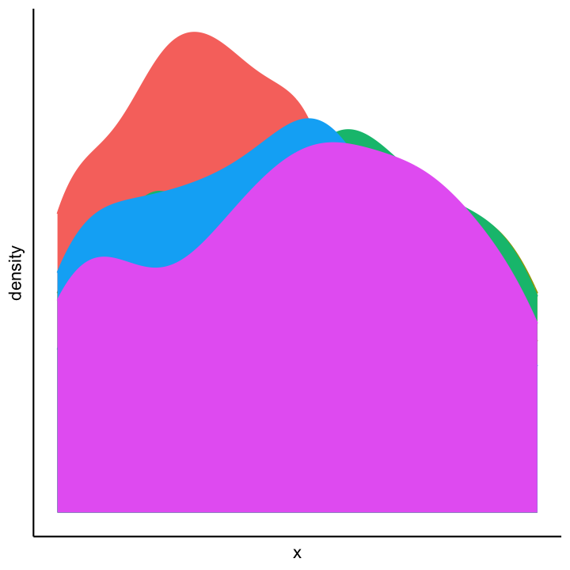

An alternative is to plot lines which allows us to see all groups completely.  

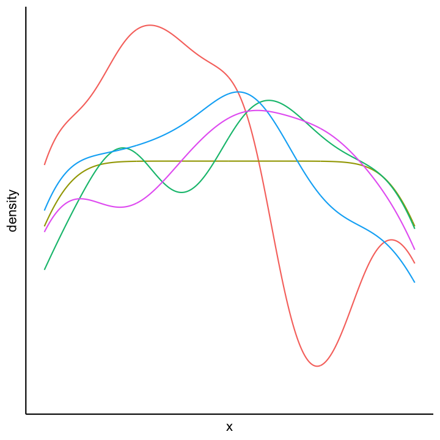

## Pie charts

Pie charts can be considered an alternative to bar charts, although often not a good one since they use angles as visual cues. For instance look at the following three visualizations. First a barplot, second a stacked barplot and lastly a pie chart. Where are differences most visible?   

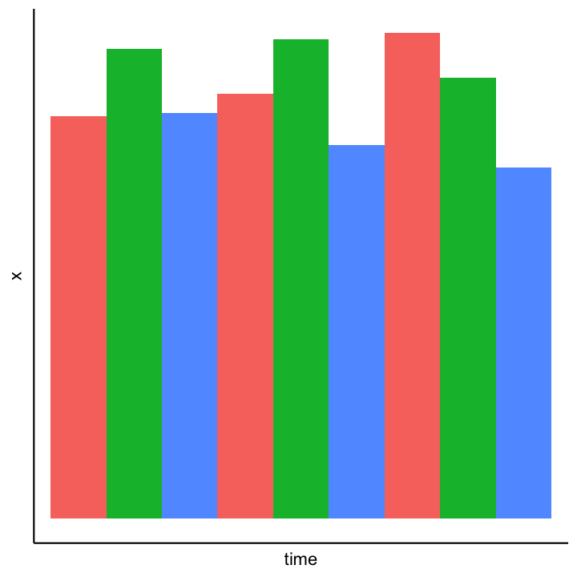

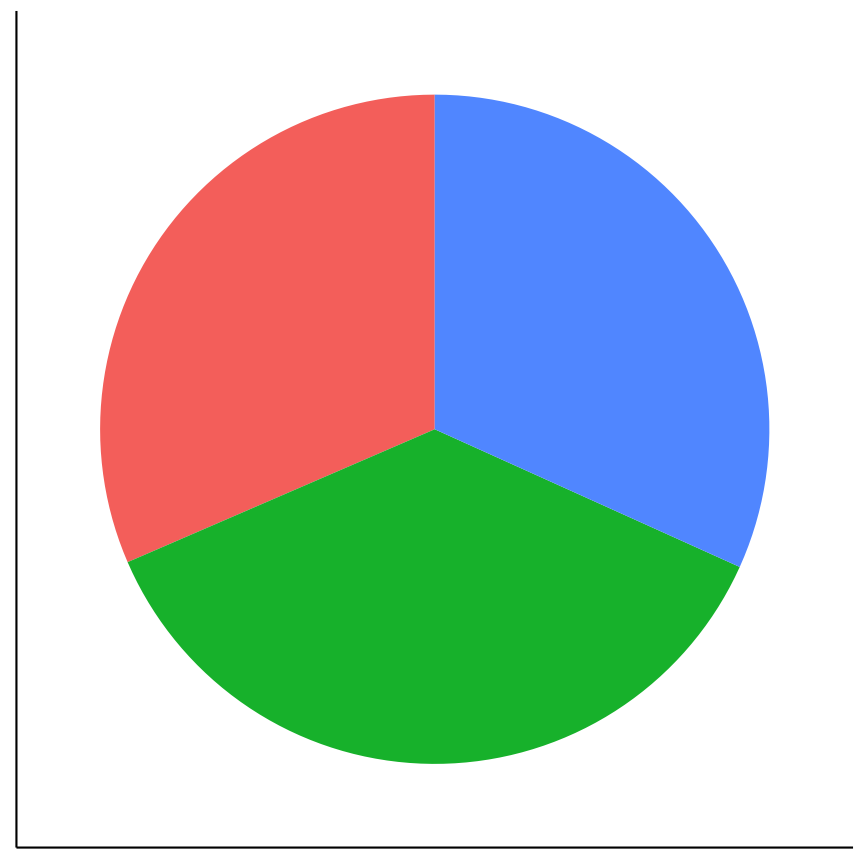

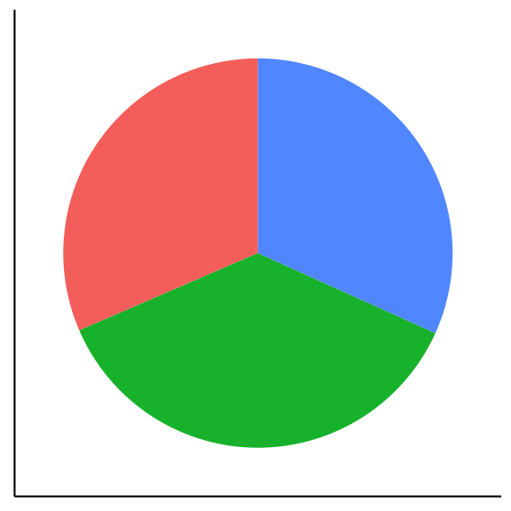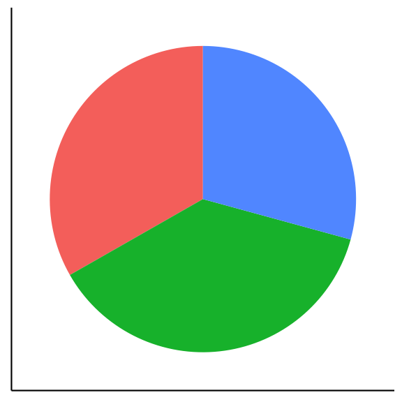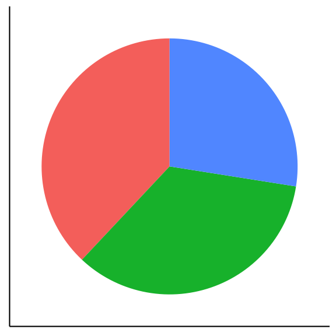

Another difficult to interpret quasi-pie chart which shows how difficult it is to see and quantify differences in a pie chart:  
{: height="300px"}

## Arrangement of plots

The arrangement of multiple plots and panels can also contribute to increasing the clarity of a visualization. Have a look at the following plot.  

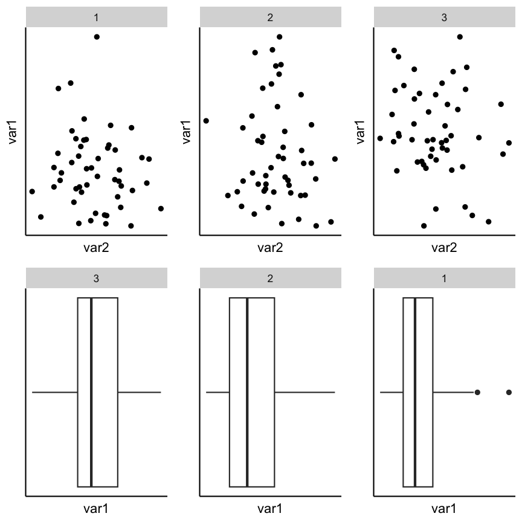

Two inconsistencies are present. First of all the order of the sample of the top row and the bottom row is not the same. Secondly in the top row `var1` is on the y-axis while in the bottom row it is on the x-axis. Staying consistent and in general have an arrangement that makes sense helps to have a clear representation that transmits the desired information efficiently. A better alternative for the above plot is:  

# 2. Show the data

## Boxplots

Boxplots are used to give a rough overview of the distribution of a data set based on a few summary characteristics (quantiles). Consider the following three boxplots each representing a different dataset. The boxplots look identical even tough the underlying distributions may not be.  

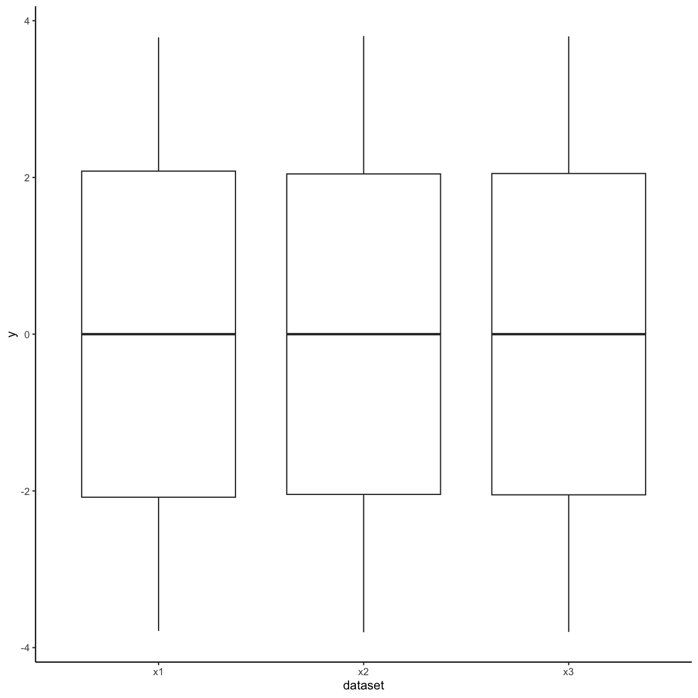

The code for the above plot:

~~~
ggplot(df_long) +
  geom_boxplot(aes(y=y,x=dataset))
~~~
{: .language-r}

Violin plots are an alternative to boxplots. They are based on an estimation of the underlying probability density, i.e. they use more information inherent in the data set. Have a look at the following three violin plots of the same datasets as above. Again, two of the violin plots look similar but the underlying data may not be identical.  

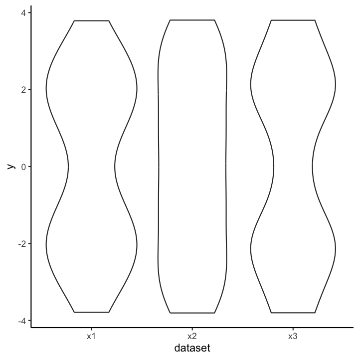

Let's finally have a look at the actual data. As you can see the samples x1 and x3 are in fact very distinct, or more precisely, x3 seems to have only 5 possible values.  

So why did the boxplot not show the distributional differences? Since boxplots only show
certain quantiles (usually the quartiles, i.e., 25%, 50% and 75%, plus "outliers") plots of different datasets having the same or similar quantiles appear identical. The quartiles of the three data sets are  

|dataset |       q25| q50|      q75|
|:-------|---------:|---:|--------:|
|x1      | -2.080552|   0| 2.080552|
|x2      | -2.044706|   0| 2.044706|
|x3      | -2.050000|   0| 2.050000|

Violin plots show a mirrored estimation of the underlying density using a smoothing technique. Loosely speaking smoothing means that starting from a histogram a smooth version of the underlying probability distribution is created. The degree of smoothing, ranging in this case from histogram to straight line, determines the actual appearence of the plot. For the violin plot the degree of smoothing is chosen automatically. Already histograms with 5 bins for the data x1 and x3 would be very similar and hence the smoothed versions thereof as well.

Caution is furthermore advised if the datasets that are compared are of very different size, because often more data gives you a higher confidence in the observed distribution. It is therefore advised to initially always have a look at the actual data and not just the summaries (like boxplots and violin plots) to detect anomalies.

Another option is the use of `geom_jitter` (or `geom_sina` from the `ggforce` package) in combination with violin plots:  

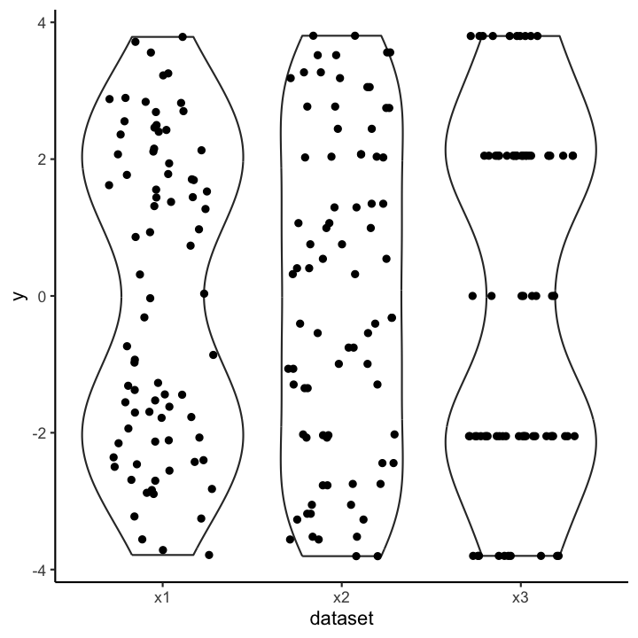

The code for the above plot:

~~~
ggplot(df_long) +
  geom_violin(aes(y=y,x=dataset)) +
  geom_jitter(aes(y=y,x=dataset),width=0.3)
~~~
{: .language-r}

The advantage is that individual points as well as the distribution are shown.

Boxplots together with `geom_jitter` are another possibility.  

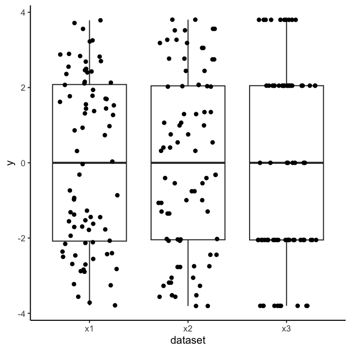

Another possibility is to only show the jittered data:

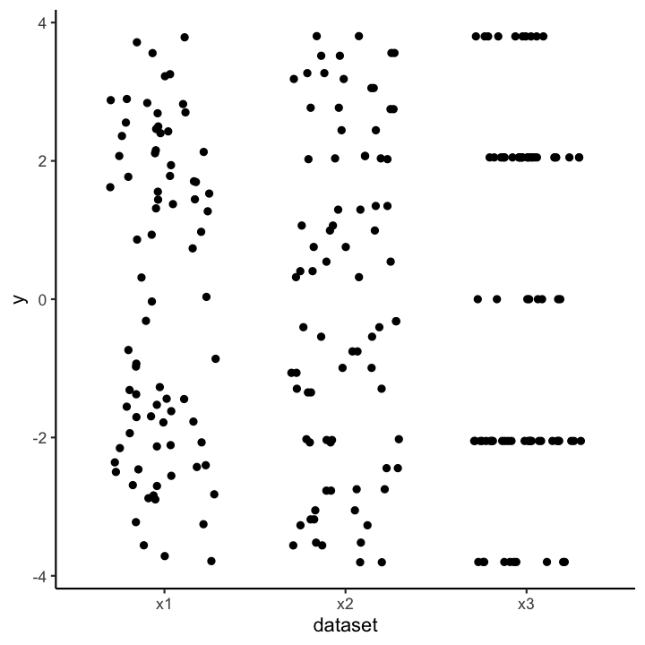

## Bar plots

The same as discussed before for boxplots also holds for barplots. If you have continuous data and see the following barplots you might conclude that the data sets are the same:

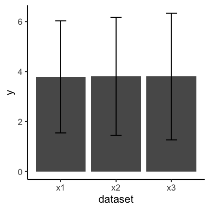

But if you also show the individual points you can see clear differences:

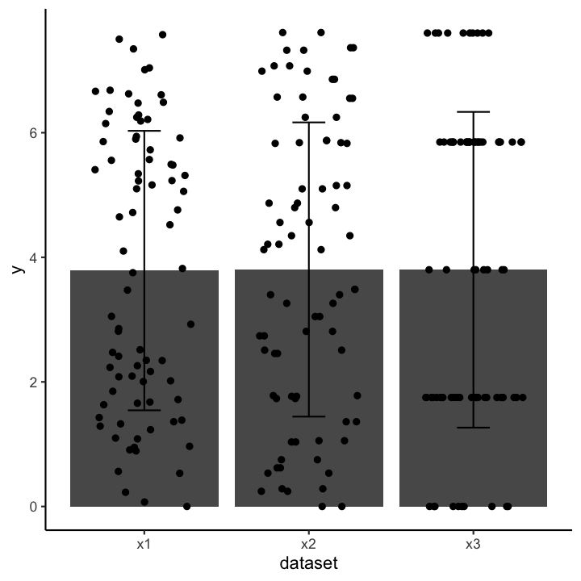

Important to keep in mind when using barplots with error bars is to state what the
error bars mean. Do they correspond to the standard deviation, the standard error or a confidence interval?
There is no clear answer to which one to use and, if possible, other types of visualizations should be used.

<!-- [NEED TO INCLUDE something on this](https://twitter.com/T_Weissgerber/status/1040576802979233793/photo/1) -->
<!-- Included one example. -->

# 3. Be honest about the axes

The axes of plots determine how much information you provide and where you put the focus. You could cut axes, blow certain parts of an axis up through transformation or hide information on certain scales if you do not transform. You can expose or hide information by choosing the aspect ratio between the x and y axis. You can provide clear and precise information through meaningful labeling of axes and axis tick marks or you can obscure the same information by deliberately choosing uninformative tick locations, for example. These issues are illustrated through example in the following

## Cutting axes

Let's consider the following two barplots. The first has a shortened axis range and shows clear differences between the datasets. The second plot on the other hand shows the enire axis starting from zero and the differences disappear. 

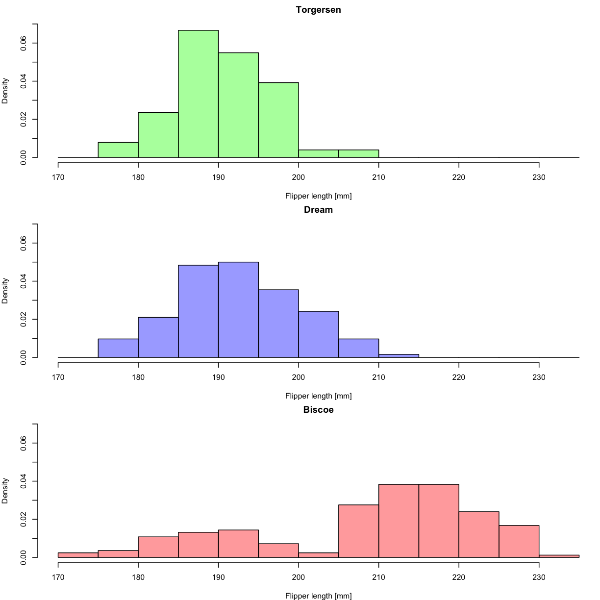

Here is a flashy, concrete example of cutting an axis, which makes differences appear much huger than they are in reality:

{: height="300px"}

The other way around is also possible. Choosing to show the entire axis starting from zero can mask differences that do matter. For instance the following graph gives "1000% proof for stable temperature and the climate change being a HOAX", simply by showing an axis from zero degree Kelvin and thus making differences seem negligibly small:

{: height="300px"}

## Axis transformation

In some cases you might have data that is on completely different scales, meaning that there are differences to be seen at different orders of magnitudes. In these 
cases it can often to be helpful to do an axis-transformation. For instance consider the 
following untransformed plot:

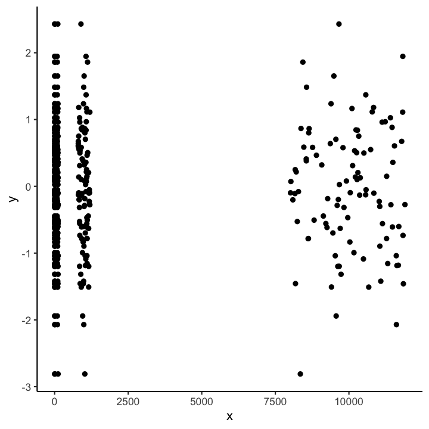

There seems to be some structure but especially for the low values it is not clear 
what is going on. If instead you do a `log10` transformation of the x-axis things get
much clearer. Axis transformations are also something to consider if you have for example
non linear scales. But beware, transformations can also be used to showcase differences that do not really matter in practice.

## Aspect ratio

The aspect ratio is another important parameter that can be manipulated to overstress certain patterns. For example, have a look at the following two plots. The first as a ratio of one, meaning the scale of the x and y axis are the same. The second plot has an aspect ration of 1/4 meaning the x axis is substantially longer.

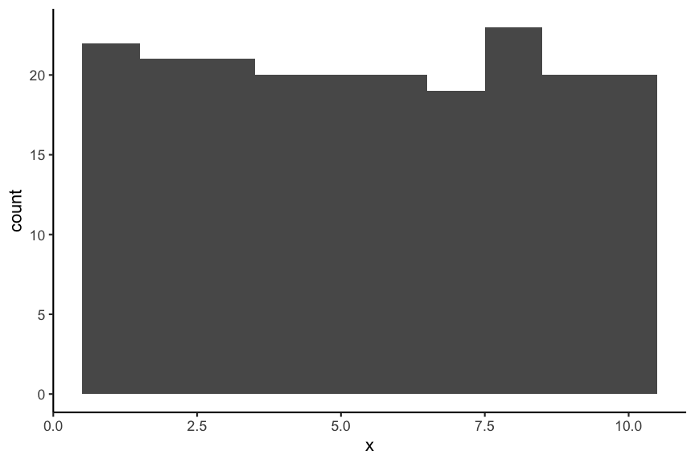

Code for the above plot:

~~~
ggplot(df) +
  geom_point(aes(x,y)) +
  coord_fixed(ratio=1)
ggplot(df) +
  geom_point(aes(x,y)) +
  coord_fixed(ratio=1/4)
~~~
{: .language-r}

Visually the second plot implies that the variance of x is much higher than of y, which is not the case: 

~~~
summarise(df, x = var(x), y = var(y))
~~~
{: .language-r}

~~~
          x         y
1 0.8332328 0.9350631
~~~
{: .output}

Also consider the following real example:

Where does the increase look the most dramatic?

## Bin width of histograms

The appearance of a histogram is determined by the bin width that is used to create it. If you
have a very large binwidth (or a low total number of bins) you might see something like this
and you would probably consider the distribution to be approximately uniformly distributed.

If on the other hand you decrease the binwidth (or increase the number of bins) you
might see something like this:

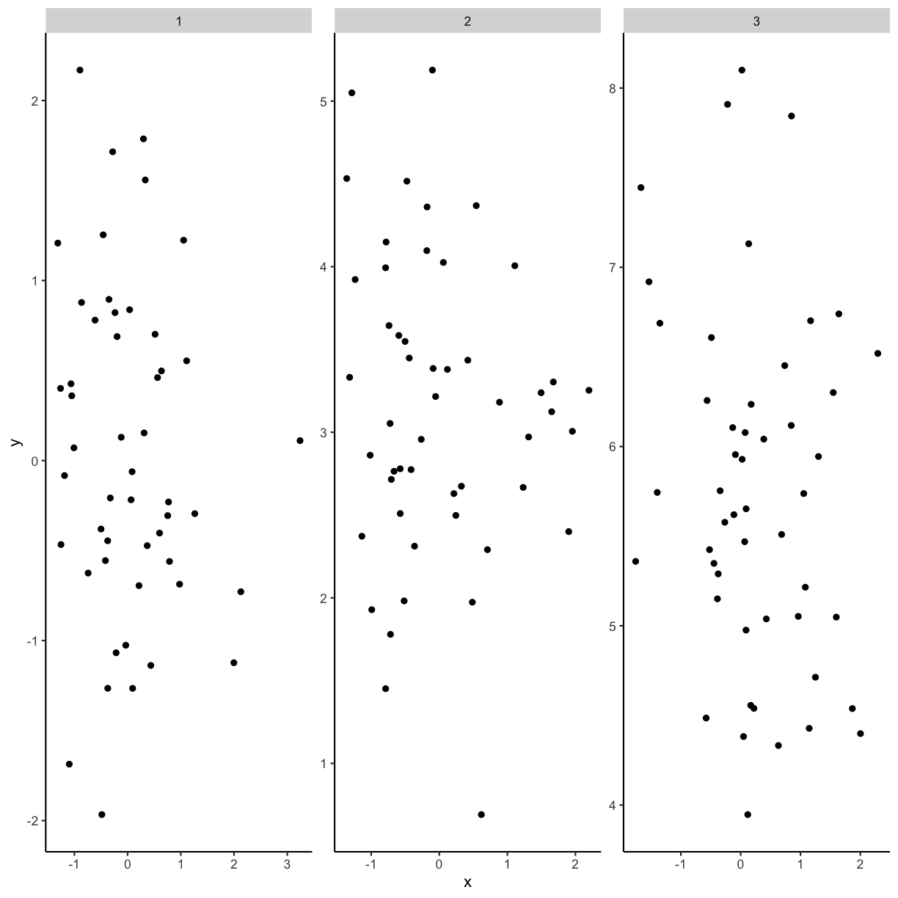

Making it quite obvious that the distribution is most definitely not uniformly distributed (on this scale). Choosing the correct bin width is not easy and depends largely on the context.

With `geom_rug` you can mark the position of individual observations:

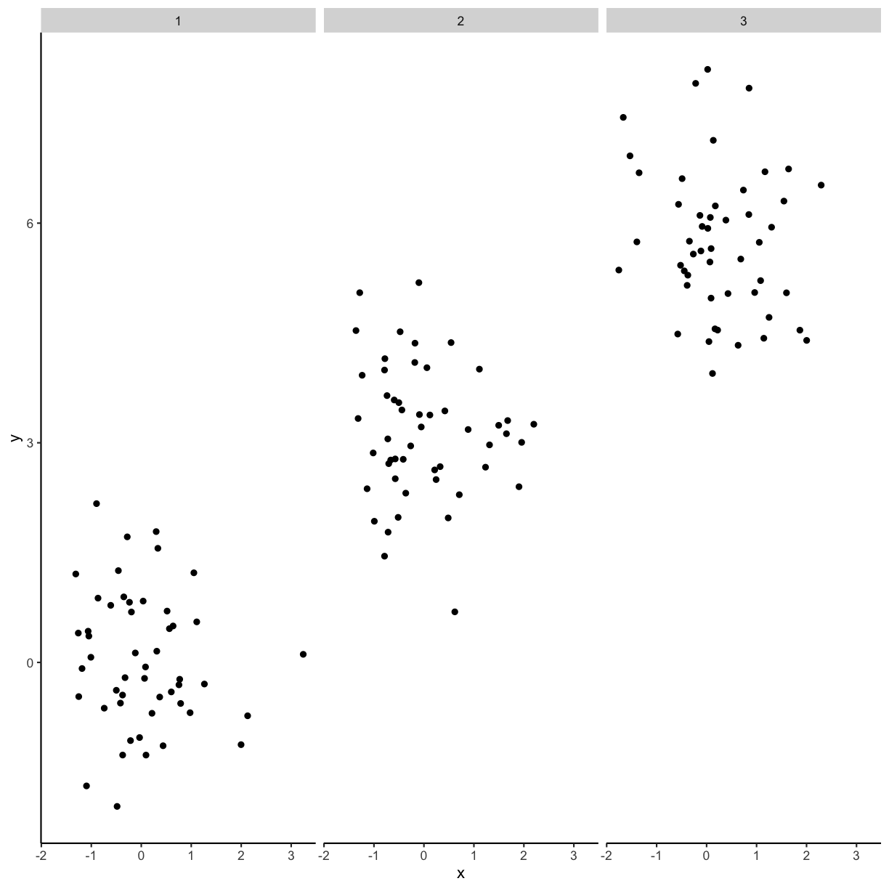

Code for the above plot:

~~~
ggplot(df,aes(x)) +
  geom_histogram(binwidth = 0.5) +
  geom_rug()
~~~
{: .language-r}

## Axis scales in multiple plots

If you provide plots in multiple panels, each using the same variables, you need to pay attention to the scale of each subplot. For example have a look at the following plot.   

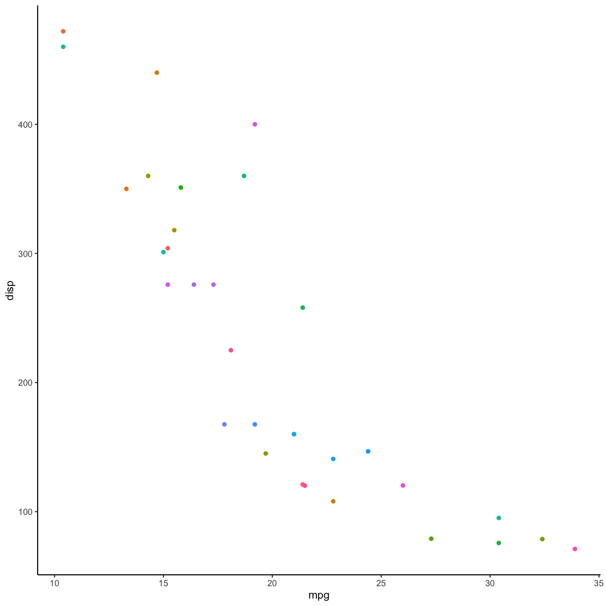

At first glance the distribution of each of the three samples looks the same. But if you look closely you can see that the scales are not the same for each subplot. If you instead keep the scale the same across subplots you get a visualization with clear differences of the distributions between the different samples.

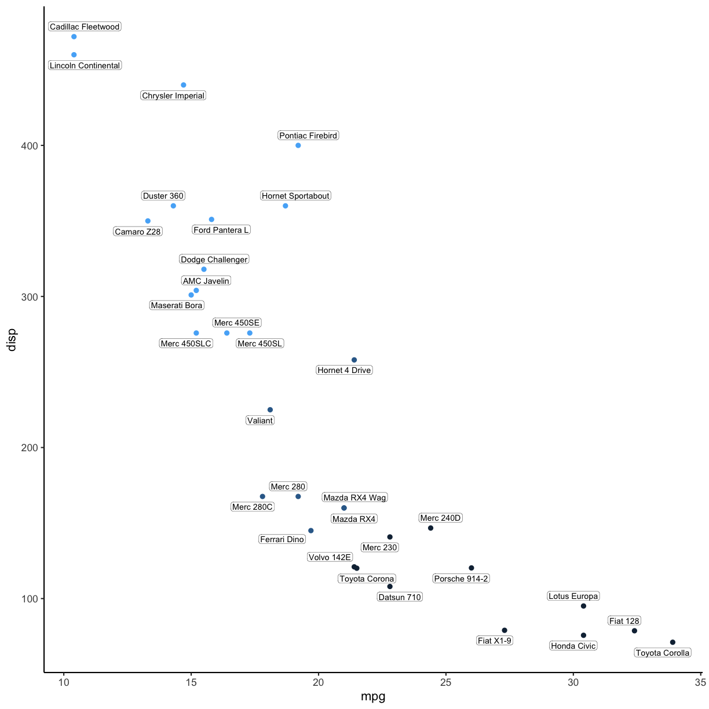

Code for the above plot:

~~~
ggplot(df) +
  geom_point(aes(x,y)) +
  facet_wrap(~sample)
~~~
{: .language-r}

Another example of using different scales:

{: height="300px"}

# 4. Use colors sensibly

## Color contrast

Trying to encode more than 8 category with colors is usually not a good idea as distinction between colors can become very difficult:

<!-- Some things from here (for example, not more than 8 categories, texas map in rainbow and made better) -->
<!-- https://clauswilke.com/dataviz/color-pitfalls.html -->

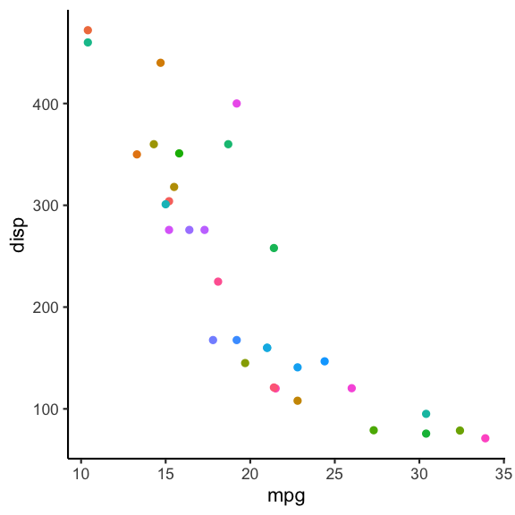

In such a case it can be a better idea to directly label the points:

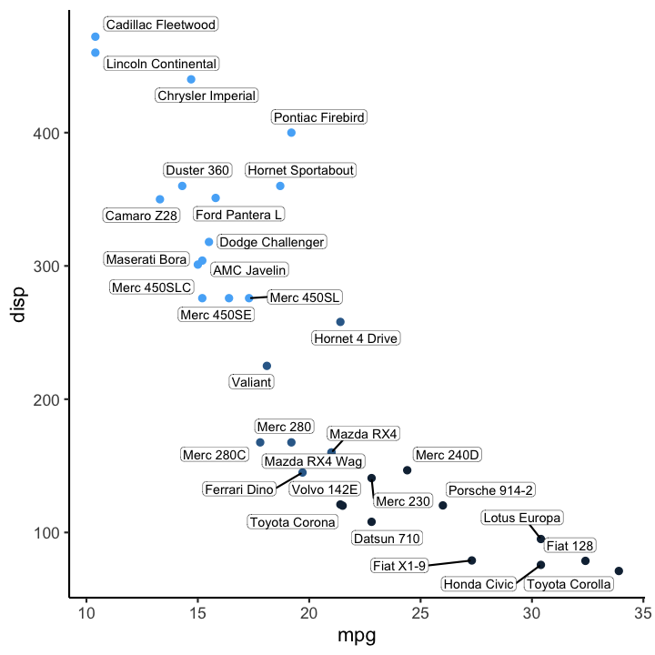

Code for the above plot:

~~~
mtcars %>% 
  rownames_to_column() %>% 
  ggplot() +
  geom_point(aes(mpg,disp,color=cyl)) +
  ggrepel::geom_label_repel(aes(mpg,disp, label=rowname),
                            size = 2.5,label.size = 0.1,
                            label.padding = 0.1)
~~~
{: .language-r}

See also: [Common pitfalls of color use](https://clauswilke.com/dataviz/color-pitfalls.html) in Fundamentals of Data Visualization.

## Color vision deficiency

About 1 of every 12 people is affected by some type of color vision deficiency[^1].
This is important to keep in mind when choosing colors for visualizations. For example consider the following scatter plot using a Red-Yellow-Green color palette, knowing that Red-Green colorblindness is the most frequent type of color deficiency.

[^1]: https://www.nei.nih.gov/learn-about-eye-health/eye-conditions-and-diseases/color-blindness

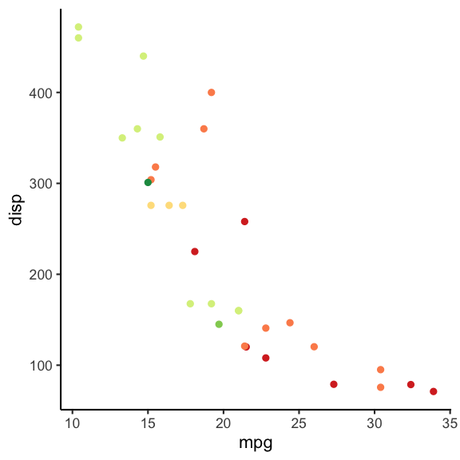

To check how the plots appear for color deficient persons you can use the `cvd_grip` function from the `colorblindr` package (install instructions on the [Github colorblindr repo](https://github.com/clauswilke/colorblindr)).

~~~
colorblindr::cvd_grid()+
    medtheme()
~~~
{: .language-r}

~~~
Error in loadNamespace(x): es gibt kein Paket namens 'colorblindr'
~~~
{: .error}

Using a different color palette can help. For example the following:  

~~~
Error in scale_color_OkabeIto(): konnte Funktion "scale_color_OkabeIto" nicht finden
~~~
{: .error}

Code for the above plot:

~~~
ggplot(mtcars) +
  geom_point(aes(mpg,disp, color=factor(carb))) +
  scale_color_OkabeIto()
~~~
{: .language-r}

Another option is the `dichromat` package which features multiple palettes for people with red-green colorblindness.

## Quiz

Let's have a look at the following master piece:

> ## 1 
> What aspect of the "Be simple, clear and to the point" input has been violated?  
> - 3D  
> - occlusion  
> - use of pie charts  
> - arrangement of multiple plots  
>
{: .challenge}

> ## Solution
> 
> T 3D  
> T occlusion  
> F use of pie charts  
> F arrangement of multiple plots  
>
{: .solution}

> ## 2 
> Is the data shown appropriately by the plot through  
> - the height of bars?  
> - the values on bars?  
> - additional values in white font?  
> - the tick marks indicating to which value each bar belongs?
> - the raw data?
>
{: .challenge}

> ## Solution
> 
> - the height of bars?  
> - the values on bars?  
> - additional values in white font?  
> - the tick marks indicating to which value each bar belongs?
> - the raw data?
>
{: .solution}

> ## 3 
> What could be the reason that the Y-axis is shown starting at the value 55?  
> - the value 55 could be the smallest possible value in the context  
> - the differences between the bars are more pronounced than if the Y-axis starts at zero.  
> - the values below 55 need to be hidden  
>
{: .challenge}

> ## Solution
> 
> T the value 55 could be the smallest possible value in the context  
> T the differences between the bars are more pronounced than if the Y-axis starts at zero.  
> T the values below 55 need to be hidden  
>
{: .solution}

> ## 4 
> When you think about the information regarding the axes, please tick which one of the following items is present in the plot  
> - Sensible X-axis tick label display  
> - Sensible X-axis label  
> - Sensible Y-axis tick values  
> - Sensible Y axis label  
>
{: .challenge}

> ## Solution
> 
> - Sensible X-axis tick label display  
> - Sensible X-axis label  
> - Sensible Y-axis tick values  
> - Sensible Y axis label  
>
{: .solution}

> ## 5 
> Does the displayed grid help to determine the height of the color sections of the bars?  
> - Yes  
> - No  
>
{: .challenge}

> ## Solution
> 
> F Yes  
> T No
>
{: .solution}

> ## 6 
> Is the used color palette color-blind friendly?  
> - Yes  
> - No  
>
{: .challenge}

> ## Solution
> 
> F Yes  
> T No
>
{: .solution}

> ## 7 
> Which of the following additional information items does the plot feature?  
> - Informative title  
> - Informative legend labels  
> - Provenance of data  
> - Context of data  
>
{: .challenge}

> ## Solution
> 
> - Informative title  
> - Informative legend labels  
> - Provenance of data  
> - Context of data  
>
{: .solution}

> ## 8 
> Does the course team think this is a good plot?  
> - Yes  
> - No  
>
{: .challenge}

> ## Solution
> 
> F Yes  
> T No
>
{: .solution}

# A short introduction to `ggplot2`

We additionally provide a quick introduction to the widely used package `ggplot2`. It is based on the idea of a grammar of graphics, in other words well defined instructions of how to create a plot.

{: height="500px"}

## Data example

We will not go further into the theoretical details but instead jump right into the practical part. Before creating our first ggplot we load `ggplot2` and have a look at the `cars` dataset that we will use.

~~~
                   mpg cyl disp  hp drat    wt  qsec vs am gear carb
Mazda RX4         21.0   6  160 110 3.90 2.620 16.46  0  1    4    4
Mazda RX4 Wag     21.0   6  160 110 3.90 2.875 17.02  0  1    4    4
Datsun 710        22.8   4  108  93 3.85 2.320 18.61  1  1    4    1
Hornet 4 Drive    21.4   6  258 110 3.08 3.215 19.44  1  0    3    1
Hornet Sportabout 18.7   8  360 175 3.15 3.440 17.02  0  0    3    2
Valiant           18.1   6  225 105 2.76 3.460 20.22  1  0    3    1
~~~
{: .output}

## First plot

Running the following command will initialize a ggplot object without yet showing anything since we don't tell it what to show.

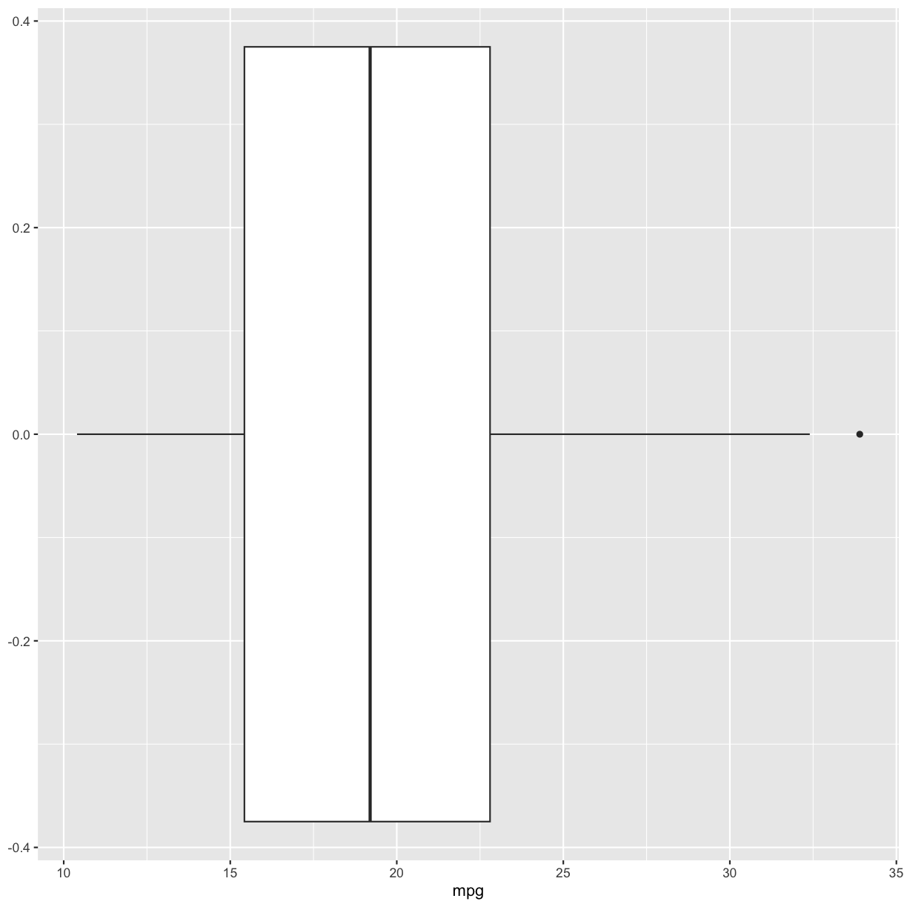

To create a plot we have to specify what kind of plot - or geom - we want to use. In this case we want a scatter plot so we choose `geom_point`. For other possibilities check the `ggplot2` documentation (e.g. `?ggplot2`) or just do a Google search. Furthermore we have to specify which columns in our dataset we want to use for which axis. Or in other words assign columns of the data to the x and y aesthetic (`aes`). To check which aesthetic is available for which geom check the *Aesthetics* paragraph in the documentation in the respective geom (e.g. in `?geom_point`).

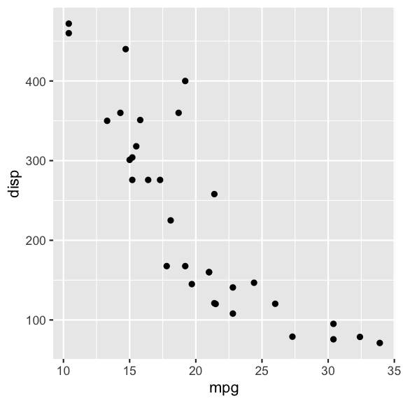

If we want to show `mpg` on the y-axis and `disp` on the x-axis:

If we want a boxplot plot we could do

or:

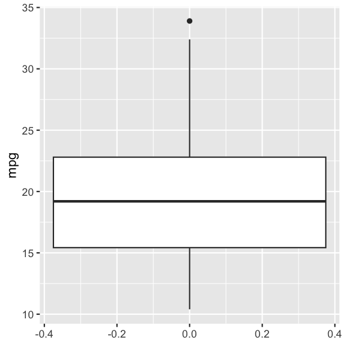

To color the plot according to another column in the data the `color` (or `colour`) aesthetic can be used.

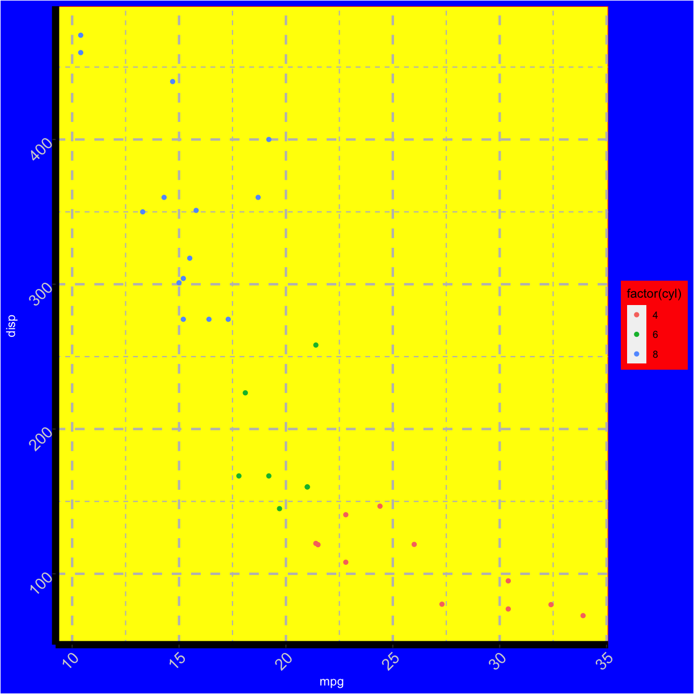

## Plot options

Many options to change the appearance of plots are available For example change labels:

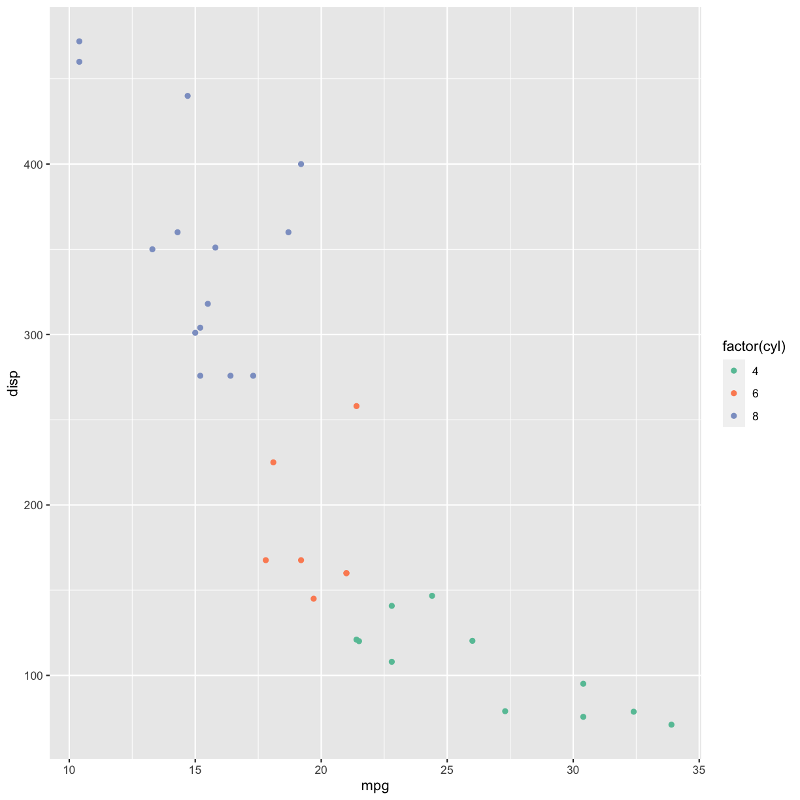

Or change the theme (for all options check out the help page from `theme`). Either using a predefined theme.

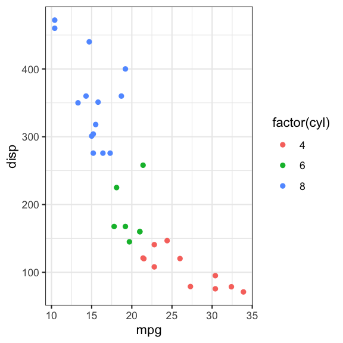

Or creating your own. (Can you figure out what each of the arguments in `theme` do?)

~~~
Warning: The `size` argument of `element_line()` is deprecated as of ggplot2 3.4.0.
ℹ Please use the `linewidth` argument instead.
This warning is displayed once every 8 hours.
Call `lifecycle::last_lifecycle_warnings()` to see where this warning was
generated.
~~~
{: .warning}

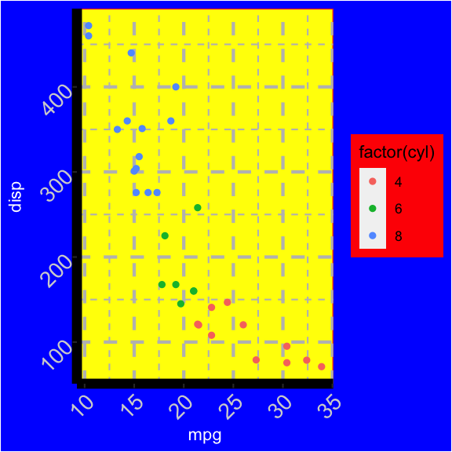

Changing the color palette used can be done by using either a custom palette (in this case generated using the `RColorBrewer` package)

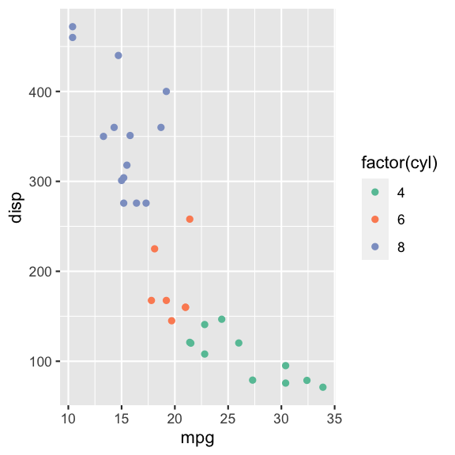

or by directly using an existing scale (usually of the form `scale_color_NAME`). Further options will be given below.

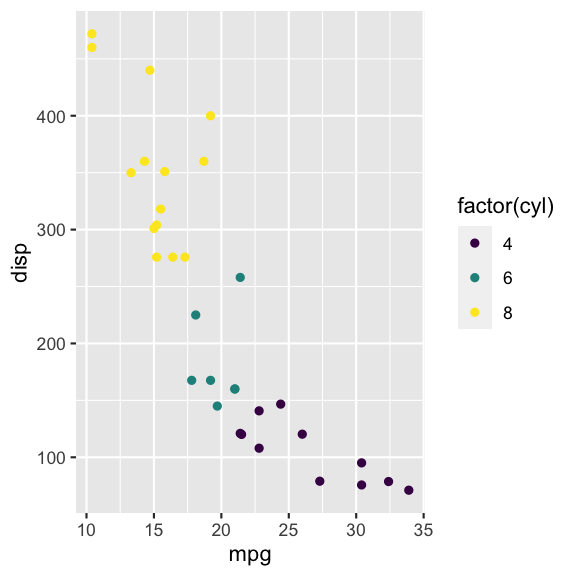

# Episode challenge

For this challenge we will work with climate data published by the Bundesamt für Statistic BFS in which
various climate related variables measured at different locations in Switzerland have been put together.
The data has already been wrangled into a csv file that you can download from [here.](/static/climate_data.csv)

The source data was downloaded from here: [https://www.bfs.admin.ch/asset/de/je-d-02.03.03.02](https://www.bfs.admin.ch/asset/de/je-d-02.03.03.02) and here: [https://www.bfs.admin.ch/asset/de/je-d-02.03.03.03](https://www.bfs.admin.ch/asset/de/je-d-02.03.03.03)

## Task 1: data exploration

In this first task read in the `climate_data.csv` file and do a short exploration of the dataset.

## 1.1 First look

Show the top 3 rows of the dataset and additionally a short summary of the dataset (*Hint*: use `summary`). Describe what you observe in a few words.

## 1.2 Which has been the hottest year?

## 1.3 Which has been the coldest year?

## Task 2: visualization

## 2.1 Association of `Annual_temperature` and `Year`

The goal is to visualize the association of `Annual_temperature` and `Year`.
To increase the visibility we will only look at the locations `ZürichFluntern`, `Säntis`, `Samedan`, `LocarnoMonti`. 

Choose a suitable visualization (maybe consider looking at the decision tree) and plot the respective graph.

## 2.2 Add information on the altitude

Based on the previous plot update / change your plot to also include the information about the altitude. Make sure that the location information is also provided.

## 2.3 Normalization

In the next step we want to normalize the Annual temperature by using the values of the years <1951 as a base. I.e. calculate the mean `Annual_temperature` for `Year`<1951 for each `Location` and subtract this value from `Annual_temperature`.  Present a visualization that allows to study the deviation from this annual mean by location. 

## 2.4 Associations between `Annual_Precipitation`, and `Sunshine_duration`

The next goal is to explore associations between `Annual_Precipitation`, and `Sunshine_duration` for the locations `ZürichFluntern`,`Säntis`,`Samedan`,`LocarnoMonti`. Present at least two different types of plots.

# Bonus challenge

We have already shortly had a look at facets which allow to easily arrange multiple plots. But so far we have only considered the case where each subplot shows the same variables, e.g `Sunshine_duration` vs. `Annual_frost_days`. What if instead you would like to use facets to plot multiple variables? For instance you would like to do a plot containing two subplots, the first `Annual_frost_days` vs. `Sunshine_duration` and the second `Annual_summer_days` vs. `Sunshine_duration`?

There are basically two options:

* Do both plots separately and then combine them
* Do both plots simultaneously using facets

We will in the following explore both options.

&nbsp;

## Combine plots

There are many options available how to combine plots. Two useful packages are `cowplot` (for all graphics) and `ggpubr` (for ggplots). In this exercise we will use `ggpubr`.

&nbsp;

## Exercise 1

Create two `ggplot2` scatterplots, `Annual_frost_days` vs. `Sunshine_duration` and `Annual_summer_days` vs. `Sunshine_duration`, color by location. Combine the two plots using `ggpubr::ggarrange` and make sure to have only one legend. Also make sure to have the same axis range in both plots.

&nbsp;

## Facets

The second option is to use facets (e.g. `ggplot2::facet_wrap`). Since our data is
currently not in the correct format we first have to bring it into shape. This can be done using
`tidyr::pivot_longer` which transforms data from wide to long format. The wide format means we have multiple values per row while the long format means we only have a single value while the remaining 
columns act as an identifier of the sample. You can learn more about `pivot`, long and wide formats by running `vignette("pivot",package = "tidyr")` in the console.   

&nbsp;

## Exercise 2

Use `tidyr::pivot_longer` to bring the data into long format and plot `Annual_frost_days` vs. `Sunshine_duration` and `Annual_summer_days` vs. `Sunshine_duration` in the same plot using `ggplot2::facet_wrap`. 

*Hint*: The columns to pivot into longer format are `Annual_frost_days` and `Annual_summer_days`.

&nbsp;

## Optional: ggplot2 theme

## Rotate axis text

In some situations where labels on the x-axis are long they can overlap with the default setting:  

~~~
Warning: Removed 129 rows containing non-finite values (`stat_ydensity()`).
~~~
{: .warning}

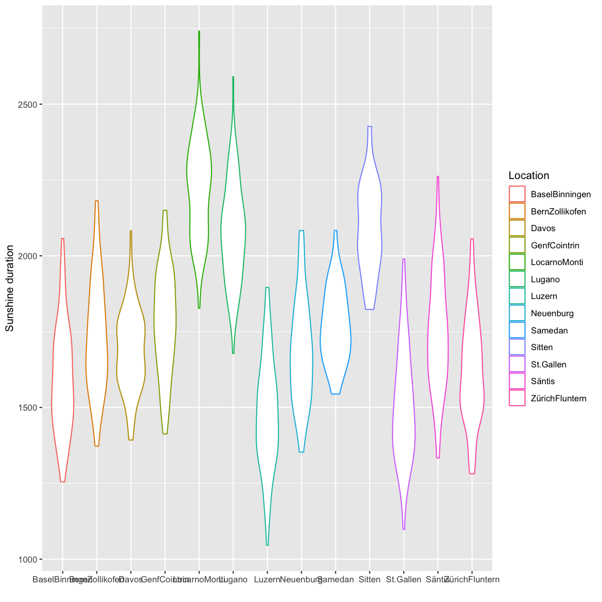

A solution can be to rotate the labels:  

~~~
Warning: Removed 129 rows containing non-finite values (`stat_ydensity()`).
~~~
{: .warning}

Reproduce the above plot.  
*Hint*: use the argument `axis.text.x` in the `theme` function and make sure to check the expected input class in `axis.text.x`.  

## Custom colors

You can generate custom colors using `RColorBrewer::brewer.pal`. The generated colors can then be used in combination with `scale_color_manual(values=generated_colors)`.

