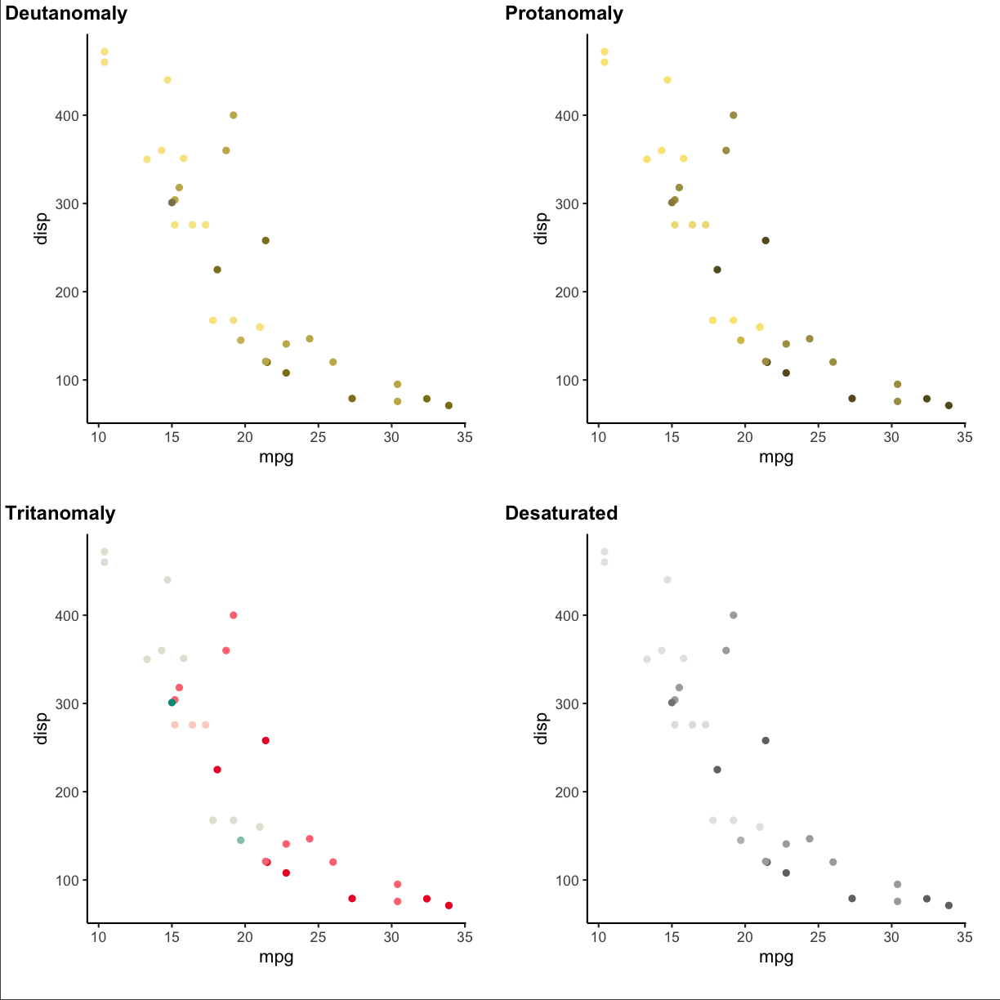
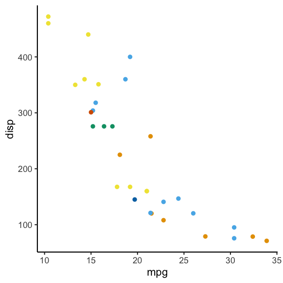
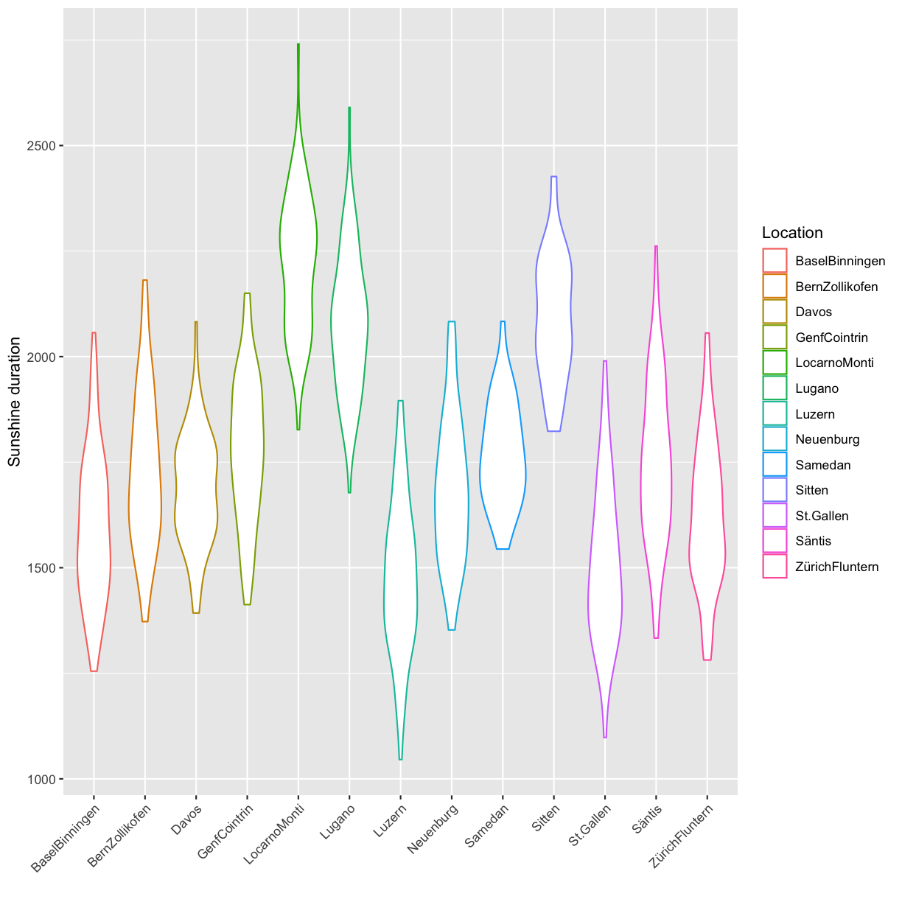
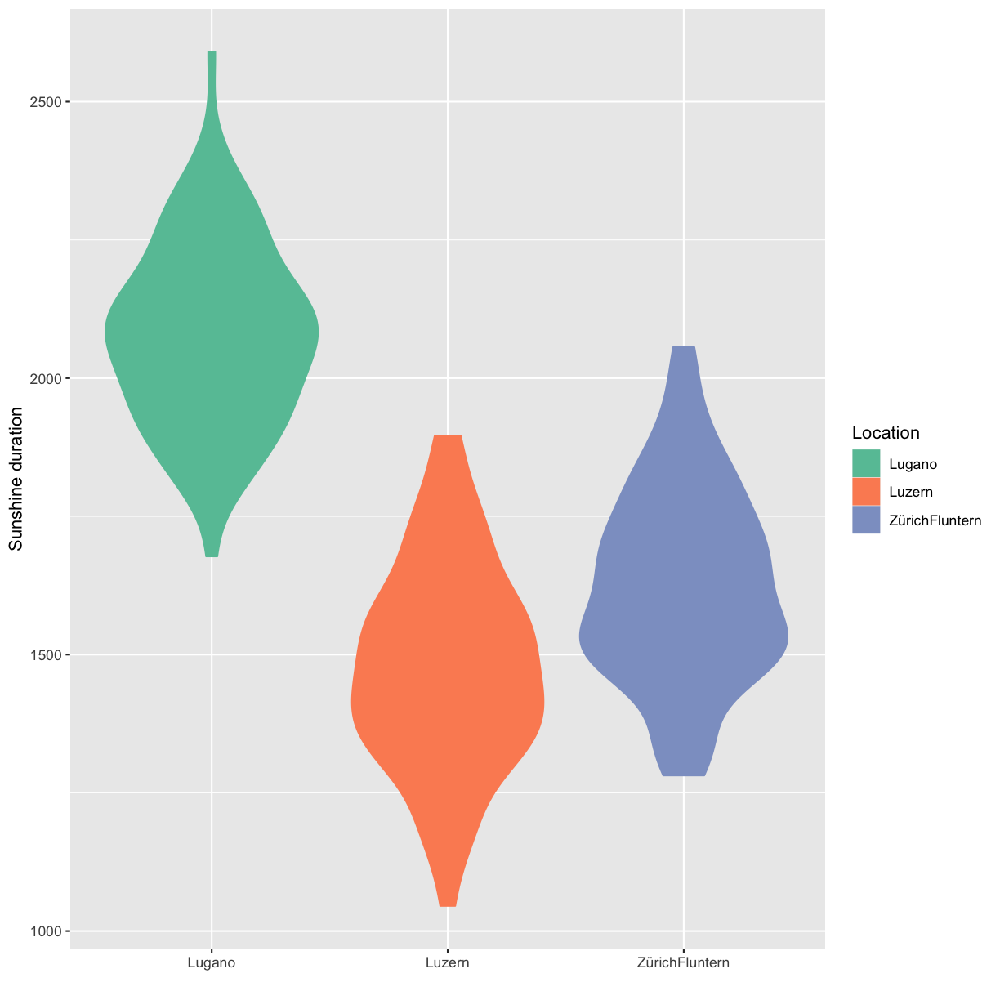

---
# Please do not edit this file directly; it is auto generated.
# Instead, please edit 06-Visualisation.md in _episodes_rmd/
source: Rmd
title: "Reproducible and honest visiualizations"
teaching: 90
exercises: 90-120
questions: 
  - "How to create graphs reproducibly?"
  - "How to transmit information truthfully in graphs?"
  - "What are the good practice principles for visualizations?"
objectives: 
  - "Learn about dos and donts for honest graphs"
  - "Learn about good practice for visualizations"
  - "Apply the principles to concrete examples"
  - "Learn the necessary R code"
keypoints:
  - "Be simple, clear and to the point"
  - "Show the data"
  - "Be honest about the axes"
  - "Use colors sensibly"
---

# Data visualization

Data visualization is omnipresent in science. Visualizations range from presenting raw data to illustrating analysis results or modeling outcomes. The way visualizations are constructed should, as any other part of the analysis, be reproducible and adhering to the basic principles of good scientific practice. For visualizations it is specifically important to honestly show the data without distorting the contained information towards an intended message, i.e. we present how to transmit information as truthfully as possible in graphs. You will practice reproducible data analysis skills while learning about best practice for graphs.

## Good practice for visualizations
  
In the following sections we will have a look at different visualizations and things to be aware of when using them with the goal of transmitting information truthfully. The most important principles of good practice for visualizations are

1. [Be simple, clear and to the point](#simple)
2. Show the data
3. Be honest about the axes
4. Use colors sensibly

We provide code in `ggplot`. A short introduction to `ggplot` is provided in this episode of the carpentries course: [R for Social Scientists](https://preview.carpentries.org/r-socialsci/05-ggplot2.html). A good reference for both systems, plots in base R and `ggplot` is the book by RD Peng: [Exploratory data analysis with R](https://bookdown.org/rdpeng/exdata/).

## 1. Be simple, clear and to the point(#simple)

### Encoding data using visual cues

As a basic principle it is useful to consider the relationship of visual cues, i.e. the type of visual encoding of quantitative data such as bars or areas, and the accuracy of the understanding of a viewer of these visualizations. The graph below shows how accurately the visualizations are perceived for different types of representation. Lengths (in form of bars) represent the data most accurately while volumes are rather generic and are more difficult to be perceived accurately. 

{: height="400px"}
Image credit: [P Aldhous](https://paldhous.github.io/ucb/2016/dataviz/img/class2_2.jpg)

The linked picture is based on [*Graphical Perception: Theory, Experimentation, and Application to the Development of Graphical Methods*](https://www.jstor.org/stable/2288400) by William S. Cleveland and Robert McGill.

Therefore, when creating a visualization you should consider the best type of visual cue that represents the data best with the goal of transmitting the intended message. For good perception of a message it is clearly better to provide simple visualizations. We discuss some specific points in more detail below.

### 3D

Providing simple and easily perceptible visualizations implies that you should avoid 3-dimensional graphical representations in most circumstances. Consider the following visualization:

{: height="300px"}
<!-- {: height="300px"} -->

As you can see (or not see!) some data is hidden behind the different bars. Furthermore it is rather difficult (and misleading) to compare the height from different depths. 

Image credit: [Josh Taylor](https://towardsdatascience.com/when-to-use-3d-in-data-visualisation-f3739e320da7)

### Avoid occlusion

As a general principle we can conclude from the 3D example that you should always avoid occlusion of some parts of the visualization. An example can be found in the following plot showing multiple densities in the same panel. The different densities where colored according to group but only the density in the front is fully visible.

plot of chunk unnamed-chunk-3

An alternative is to plot lines which allows us to see all groups completely.  

plot of chunk unnamed-chunk-4

### Pie charts

Pie charts can be considered an alternative to bar charts, although often not a good one since they use angles as visual cues. For instance look at the following three visualizations. First a barplot, second a stacked barplot and lastly a pie chart. Where are differences most visible?   

plot of chunk unnamed-chunk-5

plot of chunk unnamed-chunk-6

plot of chunk unnamed-chunk-7

plot of chunk unnamed-chunk-7

plot of chunk unnamed-chunk-7

### Arrangement of plots

The arrangement of multiple plots and panels can also contribute to increasing the clarity of a visualization. Have a look at the following plot.  

plot of chunk unnamed-chunk-8

Two inconsistencies are present. First of all the order of the sample of the top row and the bottom row is not the same. Secondly in the top row `var1` is on the y-axis while in the bottom row it is on the x-axis. Staying consistent and in general have an arrangement that makes sense helps to have a clear representation that transmits the desired information efficiently. A better alternative for the above plot is:  

plot of chunk unnamed-chunk-9

## 2. Show the data

### Boxplots

Boxplots are used to give a rough overview of the distribution of a data set based on a few summary characteristics (quantiles). Consider the following three boxplots each representing a different dataset. The boxplots look identical even tough the underlying distributions may not be.  

plot of chunk histo_only

The code for the above plot:

~~~
ggplot(df_long) +
  geom_boxplot(aes(y = y, x = dataset))
~~~
{: .language-r}

Violin plots are an alternative to boxplots. They are based on an estimation of the underlying probability density, i.e. they use more information inherent in the data set. Have a look at the following three violin plots of the same datasets as above. Again, two of the violin plots look similar but the underlying data may not be identical.  

plot of chunk unnamed-chunk-12

Let's finally have a look at the actual data. As you can see the samples x1 and x3 are in fact very distinct, or more precisely, x3 seems to have only 5 possible values.  

plot of chunk unnamed-chunk-13

So why did the boxplot not show the distributional differences? Since boxplots only show
certain quantiles (usually the quartiles, i.e., 25%, 50% and 75%, plus "outliers") plots of different datasets having the same or similar quantiles appear identical. The quartiles of the three data sets are  

|dataset |       q25| q50|      q75|
|:-------|---------:|---:|--------:|
|x1      | -2.080552|   0| 2.080552|
|x2      | -2.044706|   0| 2.044706|
|x3      | -2.050000|   0| 2.050000|

Violin plots show a mirrored estimation of the underlying density using a smoothing technique. Loosely speaking smoothing means that starting from a histogram a smooth version of the underlying probability distribution is created. The degree of smoothing, ranging in this case from histogram to straight line, determines the actual appearence of the plot. For the violin plot the degree of smoothing is chosen automatically. Already histograms with 5 bins for the data x1 and x3 would be very similar and hence the smoothed versions thereof as well.

Caution is furthermore advised if the datasets that are compared are of very different size, because often more data gives you a higher confidence in the observed distribution. It is therefore advised to initially always have a look at the actual data and not just the summaries (like boxplots and violin plots) to detect anomalies.

Another option is the use of `geom_jitter` (or `geom_sina` from the `ggforce` package) in combination with violin plots:  

plot of chunk unnamed-chunk-15

The code for the above plot:

~~~
ggplot(df_long) +
  geom_violin(aes(y = y, x = dataset)) +
  geom_jitter(aes(y = y, x = dataset), width = 0.3)
~~~
{: .language-r}

The advantage is that individual points as well as the distribution are shown.

Boxplots together with `geom_jitter` are another possibility.  

plot of chunk unnamed-chunk-17

Another possibility is to only show the jittered data:

plot of chunk unnamed-chunk-18

### Bar plots

The same as discussed before for boxplots also holds for barplots. If you have continuous data and see the following barplots you might conclude that the data sets are the same:

plot of chunk unnamed-chunk-19

But if you also show the individual points you can see clear differences:

plot of chunk unnamed-chunk-20

Important to keep in mind when using barplots with error bars is to state what the
error bars mean. Do they correspond to the standard deviation, the standard error or a confidence interval?
There is no clear answer to which one to use and, if possible, other types of visualizations should be used.

## 3. Be honest about the axes

The axes of plots determine how much information you provide and where you put the focus. You could cut axes, blow certain parts of an axis up through transformation or hide information on certain scales if you do not transform. You can expose or hide information by choosing the aspect ratio between the x and y axis. You can provide clear and precise information through meaningful labeling of axes and axis tick marks or you can obscure the same information by deliberately choosing uninformative tick locations, for example. These issues are illustrated through example in the following

### Cutting axes

Let's consider the following two barplots. The first has a shortened axis range and shows clear differences between the datasets. The second plot on the other hand shows the enire axis starting from zero and the differences disappear. 

plot of chunk unnamed-chunk-22

plot of chunk unnamed-chunk-23

See this concrete example of cutting an axis, which makes differences appear much huger than they are in reality:

{: height="300px"}
Image credit: [Helena Jambor](https://thenode.biologists.com/non-zero-baselines-the-good-the-bad-and-the-ugly/resources/)

### Axis transformation

In some cases you might have data that is on completely different scales, meaning that there are differences to be seen at different orders of magnitudes. In these 
cases it can often to be helpful to do an axis-transformation. For instance consider the 
following untransformed plot:

plot of chunk unnamed-chunk-25

There seems to be some structure but especially for the low values it is not clear 
what is going on. If instead you do a `log10` transformation of the x-axis things get
much clearer. Axis transformations are also something to consider if you have for example
non linear scales. But beware, transformations can also be used to showcase differences that do not really matter in practice.

plot of chunk unnamed-chunk-26

### Aspect ratio

The aspect ratio is another important parameter that can be manipulated to overstress certain patterns. For example, have a look at the following two plots. The first as a ratio of one, meaning the scale of the x and y axis are the same. The second plot has an aspect ration of 1/4 meaning the x axis is substantially longer.

plot of chunk unnamed-chunk-28

plot of chunk unnamed-chunk-29

Code for the above plot:

~~~
ggplot(df) +
  geom_point(aes(x, y)) +
  coord_fixed(ratio = 1)
ggplot(df) +
  geom_point(aes(x, y)) +
  coord_fixed(ratio = 1 / 4)
~~~
{: .language-r}

Visually the second plot implies that the variance of x is much higher than of y, which is not the case: 

~~~
summarise(df, x = var(x), y = var(y))
~~~
{: .language-r}

~~~
          x         y
1 0.8332328 0.9350631
~~~
{: .output}

Also consider the following real example. Where does the increase look the most dramatic?

{: height="300px"}

Image credit: [Demetris Christodoulou](https://graphworkflow.com/enhancement/aspect/)

### Bin width of histograms

The appearance of a histogram is determined by the bin width that is used to create it. If you
have a very large binwidth (or a low total number of bins) you might see something like this
and you would probably consider the distribution to be approximately uniformly distributed.

plot of chunk unnamed-chunk-32

If on the other hand you decrease the binwidth (or increase the number of bins) you
might see something like this:

plot of chunk unnamed-chunk-33

Making it quite obvious that the distribution is most definitely not uniformly distributed (on this scale). Choosing the correct bin width is not easy and depends largely on the context.

With `geom_rug` you can mark the position of individual observations:

plot of chunk unnamed-chunk-34

Code for the above plot:

~~~
ggplot(df, aes(x)) +
  geom_histogram(binwidth = 0.5) +
  geom_rug()
~~~
{: .language-r}

### Axis scales in multiple plots

If you provide plots in multiple panels, each using the same variables, you need to pay attention to the scale of each subplot. For example have a look at the following plot.   

plot of chunk unnamed-chunk-36

At first glance the distribution of each of the three samples looks the same. But if you look closely you can see that the scales are not the same for each subplot. If you instead keep the scale the same across subplots you get a visualization with clear differences of the distributions between the different samples.

plot of chunk unnamed-chunk-37

Code for the above plot:

~~~
ggplot(df) +
  geom_point(aes(x, y)) +
  facet_wrap( ~ sample)
~~~
{: .language-r}

## 4. Use colors sensibly

### Color contrast

Trying to encode more than 8 category with colors is usually not a good idea as distinction between colors can become very difficult:

plot of chunk unnamed-chunk-39

In such a case it can be a better idea to directly label the points:

~~~
Warning: ggrepel: 2 unlabeled data points (too many overlaps). Consider
increasing max.overlaps
~~~
{: .warning}

plot of chunk unnamed-chunk-40

Code for the above plot:

~~~
mtcars %>% 
  rownames_to_column() %>% 
  ggplot() +
  geom_point(aes(mpg, disp, color = cyl)) +
  ggrepel::geom_label_repel(aes(mpg, disp, label = rowname),
                            size = 2.5, label.size = 0.1,
                            label.padding = 0.1)
~~~
{: .language-r}

See also: [Common pitfalls of color use](https://clauswilke.com/dataviz/color-pitfalls.html) in Fundamentals of Data Visualization.

### Color vision deficiency

About 1 of every 12 people is affected by some type of color vision deficiency (see, e.g., [here](https://www.nei.nih.gov/learn-about-eye-health/eye-conditions-and-diseases/color-blindness)).
This is important to keep in mind when choosing colors for visualizations. For example consider the following scatter plot using a Red-Yellow-Green color palette, knowing that Red-Green colorblindness is the most frequent type of color deficiency.

plot of chunk unnamed-chunk-42

To check how the plots appear for color deficient persons you can use the `cvd_grip` function from the `colorblindr` package (install instructions on the [Github colorblindr repo](https://github.com/clauswilke/colorblindr)).

~~~
colorblindr::cvd_grid() +
  medtheme()
~~~
{: .language-r}

plot of chunk unnamed-chunk-43

Using a different color palette can help. For example the following:  

plot of chunk unnamed-chunk-44

Code for the above plot:

~~~
ggplot(mtcars) +
  geom_point(aes(mpg, disp, color = factor(carb))) +
  scale_color_OkabeIto()
~~~
{: .language-r}

Another option is the `dichromat` package ([CRAN link](https://cran.r-project.org/web/packages/dichromat/index.html)) which features multiple palettes for people with red-green colorblindness.

### Quiz

Let's have a look at the graph, :

https://statmodeling.stat.columbia.edu/2008/06/06/new_candidate_f/
https://www.datocms-assets.com/42764/1664971178-3d-powerpoint-chart.png

> ## 1 
> What aspect of the "Be simple, clear and to the point" input has been violated?  
> - 3D  
> - occlusion  
> - use of pie charts  
> - arrangement of multiple plots  
>
{: .challenge}

> ## Solution
> 
> T 3D  
> T occlusion  
> F use of pie charts  
> F arrangement of multiple plots  
>
{: .solution}

> ## 2 
> Is the data shown appropriately by the plot through  
> - the height of bars?  
> - the values on bars?  
> - additional values in white font?  
> - the tick marks indicating to which value each bar belongs?
> - the raw data?
>
{: .challenge}

> ## Solution
> 
> - the height of bars?  
> - the values on bars?  
> - additional values in white font?  
> - the tick marks indicating to which value each bar belongs?
> - the raw data?
>
{: .solution}

> ## 3 
> What could be the reason that the Y-axis is shown starting at the value 55?  
> - the value 55 could be the smallest possible value in the context  
> - the differences between the bars are more pronounced than if the Y-axis starts at zero.  
> - the values below 55 need to be hidden  
>
{: .challenge}

> ## Solution
> 
> T the value 55 could be the smallest possible value in the context  
> T the differences between the bars are more pronounced than if the Y-axis starts at zero.  
> T the values below 55 need to be hidden  
>
{: .solution}

> ## 4 
> When you think about the information regarding the axes, please tick which one of the following items is present in the plot  
> - Sensible X-axis tick label display  
> - Sensible X-axis label  
> - Sensible Y-axis tick values  
> - Sensible Y axis label  
>
{: .challenge}

> ## Solution
> 
> - Sensible X-axis tick label display  
> - Sensible X-axis label  
> - Sensible Y-axis tick values  
> - Sensible Y axis label  
>
{: .solution}

> ## 5 
> Does the displayed grid help to determine the height of the color sections of the bars?  
> - Yes  
> - No  
>
{: .challenge}

> ## Solution
> 
> F Yes  
> T No
>
{: .solution}

> ## 6 
> Is the used color palette color-blind friendly?  
> - Yes  
> - No  
>
{: .challenge}

> ## Solution
> 
> F Yes  
> T No
>
{: .solution}

> ## 7 
> Which of the following additional information items does the plot feature?  
> - Informative title  
> - Informative legend labels  
> - Provenance of data  
> - Context of data  
>
{: .challenge}

> ## Solution
> 
> - Informative title  
> - Informative legend labels  
> - Provenance of data  
> - Context of data  
>
{: .solution}

> ## 8 
> Does the course team think this is a good plot?  
> - Yes  
> - No  
>
{: .challenge}

> ## Solution
> 
> F Yes  
> T No
>
{: .solution}

&nbsp;

&nbsp;

&nbsp;

# Episode challenge

For this challenge we will work with climate data published by the Bundesamt für Statistic BFS in which
various climate related variables measured at different locations in Switzerland have been put together.
The data has already been wrangled into a csv file that you can download from [here.](/static/climate_data.csv)

The source data was downloaded from here: [https://www.bfs.admin.ch/asset/de/je-d-02.03.03.02](https://www.bfs.admin.ch/asset/de/je-d-02.03.03.02) and here: [https://www.bfs.admin.ch/asset/de/je-d-02.03.03.03](https://www.bfs.admin.ch/asset/de/je-d-02.03.03.03)

## Task 1: data exploration

In this first task read in the `climate_data.csv` file and do a short exploration of the dataset.

### 1.1 First look

Show the top 3 rows of the dataset and additionally a short summary of the dataset (*Hint*: use `summary`). Describe what you observe in a few words.

>## Solution
> 
> ~~~
> head(climatedf_comp, n = 3)
> ~~~
> {: .language-r}
> 
> 
> 
> ~~~
>   Year       Location Sunshine_duration Altitude Annual_Precipitation
> 1 1931 BaselBinningen          1594.317      316                816.0
> 2 1931 BernZollikofen          1742.500      553               1137.6
> 3 1931          Davos          1767.600     1594               1077.3
>   Annual_temperature Annual_ice_days Annual_frost_days Annual_summer_days
> 1                8.5              NA                NA                 NA
> 2                7.2              NA                NA                 NA
> 3                1.7              NA                NA                 NA
>   Annual_heat_days Annual_tropic_days Annual_precipitation_days
> 1               NA                 NA                        NA
> 2               NA                 NA                        NA
> 3               NA                 NA                        NA
> ~~~
> {: .output}
> 
> 
> 
> ~~~
> summary(climatedf_comp)
> ~~~
> {: .language-r}
> 
> 
> 
> ~~~
>       Year        Location         Sunshine_duration    Altitude     
>  Min.   :1931   Length:1170        Min.   :1046      Min.   : 273.0  
>  1st Qu.:1953   Class :character   1st Qu.:1557      1st Qu.: 411.0  
>  Median :1976   Mode  :character   Median :1725      Median : 485.0  
>  Mean   :1976                      Mean   :1759      Mean   : 805.9  
>  3rd Qu.:1998                      3rd Qu.:1937      3rd Qu.: 776.0  
>  Max.   :2020                      Max.   :2741      Max.   :2501.0  
>                                    NA's   :129                       
>  Annual_Precipitation Annual_temperature Annual_ice_days  Annual_frost_days
>  Min.   : 338.9       Min.   :-3.300     Min.   :  0.00   Min.   :  1.00   
>  1st Qu.: 829.9       1st Qu.: 6.925     1st Qu.:  5.00   1st Qu.: 60.25   
>  Median :1050.5       Median : 9.000     Median : 17.00   Median : 87.00   
>  Mean   :1212.9       Mean   : 7.755     Mean   : 33.05   Mean   :107.99   
>  3rd Qu.:1411.8       3rd Qu.:10.400     3rd Qu.: 41.00   3rd Qu.:120.00   
>  Max.   :3704.2       Max.   :13.900     Max.   :218.00   Max.   :289.00   
>                                          NA's   :364      NA's   :364      
>  Annual_summer_days Annual_heat_days Annual_tropic_days
>  Min.   :  0.00     Min.   : 0.000   Min.   : 0.000    
>  1st Qu.: 12.25     1st Qu.: 0.000   1st Qu.: 0.000    
>  Median : 38.00     Median : 2.000   Median : 0.000    
>  Mean   : 36.95     Mean   : 6.257   Mean   : 1.561    
>  3rd Qu.: 56.00     3rd Qu.:10.000   3rd Qu.: 1.000    
>  Max.   :125.00     Max.   :56.000   Max.   :40.000    
>  NA's   :364        NA's   :364      NA's   :364       
>  Annual_precipitation_days
>  Min.   : 64.0            
>  1st Qu.:100.0            
>  Median :120.0            
>  Mean   :119.8            
>  3rd Qu.:136.0            
>  Max.   :229.0            
>  NA's   :365              
> ~~~
> {: .output}
> 
{: .solution}

### 1.2 Which has been the hottest year?

>## Solution
> 
> ~~~
> climatedf_comp %>% 
>   dplyr::group_by(Year) %>% 
>   dplyr::summarise(mean_temp = mean(Annual_temperature)) %>% 
>   dplyr::filter(mean_temp == max(mean_temp)) %>% 
>   dplyr::pull(Year)
> ~~~
> {: .language-r}
> 
> 
> 
> ~~~
> [1] 2018
> ~~~
> {: .output}
> 
{: .solution}

### 1.3 Which has been the coldest year?

>## Solution
> 
> ~~~
> climatedf_comp %>% 
>   dplyr::group_by(Year) %>% 
>   dplyr::summarise(mean_temp = mean(Annual_temperature)) %>% 
>   dplyr::filter(mean_temp == min(mean_temp)) %>% 
>   dplyr::pull(Year)
> ~~~
> {: .language-r}
> 
> 
> 
> ~~~
> [1] 1956
> ~~~
> {: .output}
> 
{: .solution}

## Task 2: visualization

### 2.1 Association of `Annual_temperature` and `Year`

The goal is to visualize the association of `Annual_temperature` and `Year`.
To increase the visibility we will only look at the locations `ZürichFluntern`, `Säntis`, `Samedan`, `LocarnoMonti`. 

Choose a suitable visualization (maybe consider looking at the decision tree) and plot the respective graph.

>## Solution
> 
> ~~~
> climatedf_comp %>% 
>   dplyr::filter(Location %in% c("ZürichFluntern", 
>                                 "Säntis", 
>                                 "Samedan", 
>                                 "LocarnoMonti")) %>%
>   ggplot() +
>   geom_line(aes(Year, Annual_temperature, color = Location)) +
>   labs(y = "Annual temperature")
> ~~~
> {: .language-r}
> 
> 

> 
> 
plot of chunk unnamed-chunk-50

> 

> 
{: .solution}

### 2.2 Add information on the altitude

Based on the previous plot update / change your plot to also include the information about the altitude. Make sure that the location information is also provided.

>## Solution
> 
> ~~~
> climatedf_comp %>% 
>   dplyr::filter(Location %in% c("ZürichFluntern", 
>                                 "Säntis", 
>                                 "Samedan", 
>                                 "LocarnoMonti")) %>%
>   ggplot() +
>   geom_line(aes(Year, Annual_temperature, color = Altitude, group = Location)) +
>   geom_label(aes(Year, Annual_temperature, label = Location), 
>              data = climatedf_comp %>% 
>                dplyr::filter(Location %in% c("ZürichFluntern", 
>                                              "Säntis", 
>                                              "Samedan", 
>                                              "LocarnoMonti")) %>% 
>                dplyr::filter(Year==min(Year)+5),nudge_y = 1) +
>   labs(y = "Annual temperature")
> ~~~
> {: .language-r}
> 
> 

> 
> 
plot of chunk unnamed-chunk-51

> 

> 
{: .solution}

### 2.3 Normalization

In the next step we want to normalize the Annual temperature by using the values of the years <1951 as a base. I.e. calculate the mean `Annual_temperature` for `Year`<1951 for each `Location` and subtract this value from `Annual_temperature`.  Present a visualization that allows to study the deviation from this annual mean by location. 

>## Solution
> 
> ~~~
> climatedf_comp_translated <- climatedf_comp %>% 
>   dplyr::filter(Location %in% c("ZürichFluntern", 
>                                 "Säntis", 
>                                 "Samedan", 
>                                 "LocarnoMonti")) %>% 
>   dplyr::group_by(Location) %>% 
>   dplyr::mutate(mean_temperature = mean(Annual_temperature[Year < 1951]),
>                 Annual_temperature = Annual_temperature - mean_temperature)
> 
> ggplot(climatedf_comp_translated) +
>   geom_line(aes(Year, Annual_temperature, color = Altitude, group = Location)) +
>   facet_wrap( ~ Location) +
>   # geom_label(aes(Year, Annual_temperature, label = Location), 
>   #            data = climatedf_comp_translated %>%
>   #              dplyr::filter(Location %in% c("ZürichFluntern",
>   #                                            "Säntis",
>   #                                            "Samedan",
>   #                                            "LocarnoMonti")) %>%
>   #              dplyr::filter(Year == min(Year) + 5), nudge_y = 1) +
>   labs(y = "Annual temperature deviation from average up to 1951")
> ~~~
> {: .language-r}
> 
> 

> 
> 
plot of chunk unnamed-chunk-52

> 

> 
{: .solution}

### 2.4 Associations between `Annual_Precipitation`, and `Sunshine_duration`

The next goal is to explore associations between `Annual_Precipitation`, and `Sunshine_duration` for the locations `ZürichFluntern`,`Säntis`,`Samedan`,`LocarnoMonti`. Present at least two different types of plots.

>## Solution
> 
> ~~~
> climatedf_comp %>% 
>   dplyr::filter(Location %in% c("ZürichFluntern",
>                                 "Säntis",
>                                 "Samedan",
>                                 "LocarnoMonti")) %>%
>   ggplot() +
>   geom_point(aes(Annual_Precipitation, Sunshine_duration, color = Location))
> ~~~
> {: .language-r}
> 
> 

> 
> 
plot of chunk unnamed-chunk-53

> 

> 
> 
> ~~~
> climatedf_comp %>% 
>   dplyr::filter(Location %in% c("ZürichFluntern",
>                                 "Säntis",
>                                 "Samedan",
>                                 "LocarnoMonti")) %>% 
>   # dplyr::group_by(Location) %>% 
>   # dplyr::mutate(Sunshine_duration = scale(Sunshine_duration)) %>%
>   ggplot() +
>   geom_violin(aes(Location, Annual_Precipitation, color = Sunshine_duration)) +
>   ggforce::geom_sina(aes(Location, Annual_Precipitation, color = Sunshine_duration))
> ~~~
> {: .language-r}
> 
> 
> 
> ~~~
> Warning: The following aesthetics were dropped during statistical transformation: colour
> ℹ This can happen when ggplot fails to infer the correct grouping structure in the
>   data.
> ℹ Did you forget to specify a `group` aesthetic or to convert a numerical variable
>   into a factor?
> ~~~
> {: .warning}
> 
> 

> 
> 
plot of chunk unnamed-chunk-54

> 

> 
> 
> ~~~
> climatedf_comp %>% 
>   dplyr::filter(Location %in% c("ZürichFluntern",
>                                 "Säntis",
>                                 "Samedan",
>                                 "LocarnoMonti")) %>% 
>   # dplyr::group_by(Location) %>% 
>   # dplyr::mutate(Sunshine_duration = scale(Sunshine_duration))  %>%
>   ggplot() +
>   geom_boxplot(aes(Location, Sunshine_duration, color = Annual_Precipitation)) +
>   geom_jitter(aes(Location, Sunshine_duration, color = Annual_Precipitation))
> ~~~
> {: .language-r}
> 
> 
> 
> ~~~
> Warning: Removed 54 rows containing non-finite values (`stat_boxplot()`).
> ~~~
> {: .warning}
> 
> 
> 
> ~~~
> Warning: The following aesthetics were dropped during statistical transformation: colour
> ℹ This can happen when ggplot fails to infer the correct grouping structure in the
>   data.
> ℹ Did you forget to specify a `group` aesthetic or to convert a numerical variable
>   into a factor?
> ~~~
> {: .warning}
> 
> 
> 
> ~~~
> Warning: Removed 54 rows containing missing values (`geom_point()`).
> ~~~
> {: .warning}
> 
> 

> 
> 
plot of chunk unnamed-chunk-55

> 

> 
> ~~~
>   # ggforce::geom_sina(aes(Location, Annual_Precipitation, color = Sunshine_duration))
> ~~~
> {: .language-r}
> 
{: .solution}

&nbsp;

&nbsp;

&nbsp;

# Bonus challenge

We have already shortly had a look at facets which allow to easily arrange multiple plots. But so far we have only considered the case where each subplot shows the same variables, e.g `Sunshine_duration` vs. `Annual_frost_days`. What if instead you would like to use facets to plot multiple variables? For instance you would like to do a plot containing two subplots, the first `Annual_frost_days` vs. `Sunshine_duration` and the second `Annual_summer_days` vs. `Sunshine_duration`?

There are basically two options:

* Do both plots separately and then combine them
* Do both plots simultaneously using facets

We will in the following explore both options.

&nbsp;

## Combine plots

There are many options available how to combine plots. Two useful packages are `cowplot` (for all graphics) and `ggpubr` (for ggplots). In this exercise we will use `ggpubr`.

&nbsp;

### Exercise 1

Create two `ggplot2` scatterplots, `Annual_frost_days` vs. `Sunshine_duration` and `Annual_summer_days` vs. `Sunshine_duration`, color by location. Combine the two plots using `ggpubr::ggarrange` and make sure to have only one legend. Also make sure to have the same axis range in both plots.

>## Solution
> 
> ~~~
> minmax <- c(min=min(na.omit(c(climatedf_comp$Annual_frost_days, 
>                               climatedf_comp$Annual_summer_days))),
>                max=max(na.omit(c(climatedf_comp$Annual_frost_days, 
>                                  climatedf_comp$Annual_summer_days))))
> pl1 <- climatedf_comp %>% 
>   ggplot() +
>   geom_point(aes(Annual_frost_days, Sunshine_duration, color = Location)) +
>   xlim(minmax)+
>   labs(x="Annual frost days",
>        y="Sunshine duration")
> 
> pl2 <- climatedf_comp %>% 
>   ggplot() +
>   geom_point(aes(Annual_summer_days, Sunshine_duration, color = Location)) +
>   xlim(minmax)+
>   labs(x="Annual summer days",
>        y="Sunshine duration")
> 
> ggpubr::ggarrange(pl1, pl2, common.legend = TRUE)
> ~~~
> {: .language-r}
> 
> 

> 
> 
plot of chunk unnamed-chunk-57

> 

> 
{: .solution}

&nbsp;

## Facets

The second option is to use facets (e.g. `ggplot2::facet_wrap`). Since our data is
currently not in the correct format we first have to bring it into shape. This can be done using
`tidyr::pivot_longer` which transforms data from wide to long format. The wide format means we have multiple values per row while the long format means we only have a single value while the remaining 
columns act as an identifier of the sample. You can learn more about `pivot`, long and wide formats by running `vignette("pivot",package = "tidyr")` in the console.   

&nbsp;

### Exercise 2

Use `tidyr::pivot_longer` to bring the data into long format and plot `Annual_frost_days` vs. `Sunshine_duration` and `Annual_summer_days` vs. `Sunshine_duration` in the same plot using `ggplot2::facet_wrap`. 

*Hint*: The columns to pivot into longer format are `Annual_frost_days` and `Annual_summer_days`.

>## Solution
> 
> ~~~
> climatedf_comp %>% 
>   dplyr::select(Location, Year, Sunshine_duration, 
>                 Annual_frost_days, Annual_summer_days) %>% 
>   dplyr::rename(`Annual frost days` = Annual_frost_days,
>                 `Annual summer days` = Annual_summer_days) %>% 
>   tidyr::pivot_longer(cols = c("Annual frost days", "Annual summer days")) %>% 
>   ggplot() +
>   geom_point(aes(value, Sunshine_duration, color = Location)) +
>   facet_wrap( ~ name) +
>   labs(x = "Days", y = "Sunshine duration") 
> ~~~
> {: .language-r}
> 
> 

> 
> 
plot of chunk unnamed-chunk-58

> 

> 
{: .solution}

&nbsp;

## Optional: ggplot2 theme

### Rotate axis text

In some situations where labels on the x-axis are long they can overlap with the default setting:  

plot of chunk unnamed-chunk-59

A solution can be to rotate the labels:  

plot of chunk unnamed-chunk-60

Reproduce the above plot.  
*Hint*: use the argument `axis.text.x` in the `theme` function and make sure to check the expected input class in `axis.text.x`.  

>## Solution
> 
> ~~~
> climatedf_comp %>% 
>   ggplot() + 
>   geom_violin(aes(Location, Sunshine_duration, color = Location)) + 
>   theme(axis.text.x = element_text(angle = 45, hjust = 1)) + 
>   labs(y = "Sunshine duration", x = "")
> ~~~
> {: .language-r}
> 
{: .solution}

## Custom colors

You can generate custom colors using `RColorBrewer::brewer.pal`. The generated colors can then be used in combination with `scale_color_manual(values=generated_colors)`.

>## Solution
> 
> ~~~
> climatedf_comp_red <- climatedf_comp[climatedf_comp$Location %in% 
>                                        c("Luzern","ZürichFluntern","Lugano"), ]
> colors_use <- RColorBrewer::brewer.pal(length(unique(climatedf_comp_red$Location)), 
>                                        "Set2")
> 
> climatedf_comp_red %>% 
>   ggplot() +
>   geom_violin(aes(Location, Sunshine_duration, color = Location, fill = Location)) +
>   scale_color_manual(values = colors_use) +
>   scale_fill_manual(values = colors_use) +
>   labs(y = "Sunshine duration", x = "")
> ~~~
> {: .language-r}
> 
> 

> 
> 
plot of chunk unnamed-chunk-62

> 

> 
{: .solution}

